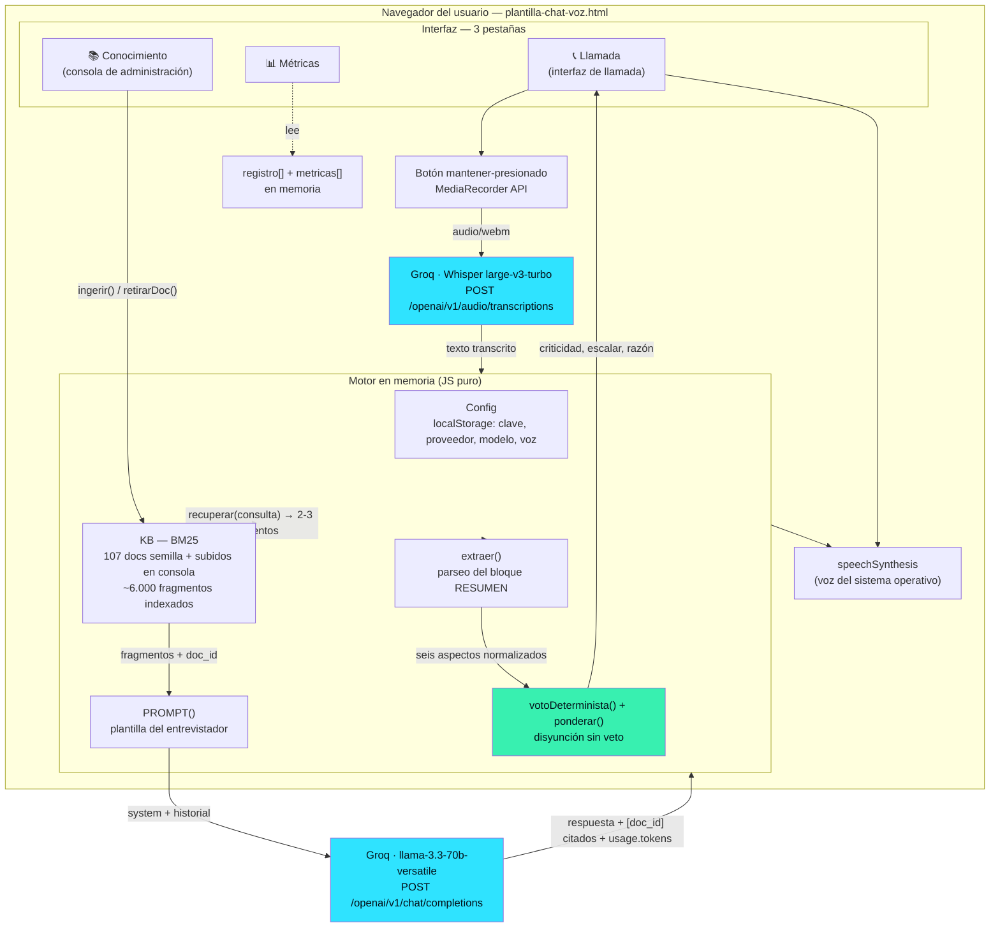
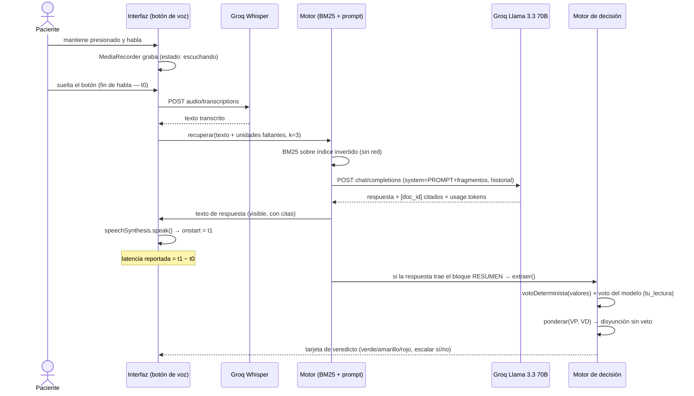
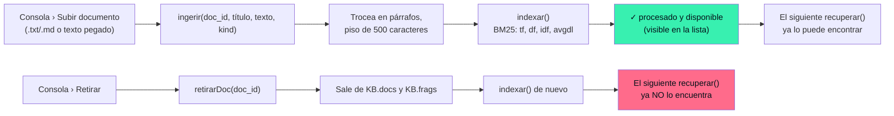

# Diagrama de arquitectura y flujo de decisión

**Source Meridian — Agente de voz post-operatorio · Tech Sphere Challenge 2026**

> Diagramas en Mermaid — se renderizan directamente en GitHub. No representan diseño visual (no evaluado); representan flujo de datos y de decisión (sí evaluado).

---

## 1 · Arquitectura de la solución

Una sola aplicación cliente (`plantilla-chat-voz.html`), sin backend propio. Las únicas dos salidas de red son directas a Groq Cloud, autenticadas con la clave que el usuario pega en Ajustes y que vive solo en `localStorage` de esa pestaña.



**Por qué no hay backend propio.** El reto permite orquestación libre; se eligió cliente-puro porque elimina el mayor riesgo de la compuerta G2 (≤15 min, credenciales incluidas): no hay servidor que pueda fallar por symlinks rotos, variables de entorno mal cargadas, ni puertos ocupados. Groq expone CORS para llamadas directas desde el navegador, así que no hace falta un proxy.

---

## 2 · Flujo de un turno de conversación



---

## 3 · Flujo de decisión — dos votos, disyunción sin veto

```mermaid
flowchart LR
    Turno["Turno de cierre:\nel modelo produce\nRESUMEN_INICIO…RESUMEN_FIN"] --> Extraer["extraer()\nseis aspectos + tu_lectura + urgencia"]

    Extraer --> VP["Voto del modelo (VP)\ntu_lectura declarada por el LLM\nverde / amarillo / rojo"]
    Extraer --> Valores["Valores normalizados\nfiebre, dolor, herida,\nmovilidad, apetito, sueño"]

    Valores --> Clasificar["clasificar() por unidad\n(reglas FC-*)"]
    Clasificar --> Componer["componer()\nCO-01: apetito+sueño cedidos\nCO-02: + fiebre → convergencia sistémica"]
    Componer --> VD["Voto determinista (VD)\ntabla de lectura declarada\nVD-01…VD-05"]

    VP --> Ponderar{"ponderar(VP, VD)\ndisyunción SIN veto"}
    VD --> Ponderar

    Ponderar -- "ambos verde" --> Verde["🟢 VERDE\nno escala"]
    Ponderar -- "cualquiera ≥ amarillo" --> NoVerde["escala"]
    NoVerde --> Amarillo["🟡 AMARILLO\nse anota, seguimiento del equipo"]
    NoVerde --> Rojo["🔴 ROJO\ncontacto hoy mismo"]

    Bandera["Bandera roja durante\nla conversación\n(sangrado, disnea, dolor torácico…)"] -. "corta la entrevista\nde inmediato, sin esperar cierre" .-> Rojo

    Verde --> Resumen["CallSummary\nsiempre se produce,\nincluso en cierres degradados"]
    Amarillo --> Resumen
    Rojo --> Resumen

    style VP fill:#8d97e8,color:#031018
    style VD fill:#2fe3ff,color:#031018
    style Rojo fill:#ff6b8b,color:#031018
    style Amarillo fill:#ffcf5c,color:#031018
    style Verde fill:#38f0b0,color:#031018
```



**Regla central verificada contra los 160 casos etiquetados del reto** (`trayectorias_postop_silver.xlsx`):

```
apetito muy_disminuido  ∧  sueño muy_alterado  ∧  fiebre ≥ 37.9
    → convergencia_sistemica → VD-01 → rojo
```

12 de 12 rojos capturados por esta composición, 0 falsos positivos, 0 falsos negativos. Ninguna variable sola discrimina — el corte por día ≥7 solo, por ejemplo, arrastra decenas de falsos positivos; solo la **composición** de las tres separa limpio.

---

## 4 · Compuerta 5 — conocimiento vivo



Verificado con un documento sintético que no pertenece a ningún corpus entregado ("Cuidado del drenaje quirúrgico Jackson-Pratt"): aparece en la recuperación tras subirlo, desaparece tras retirarlo. Prueba reproducible en `docs/informe-final.md` § evidencia.
