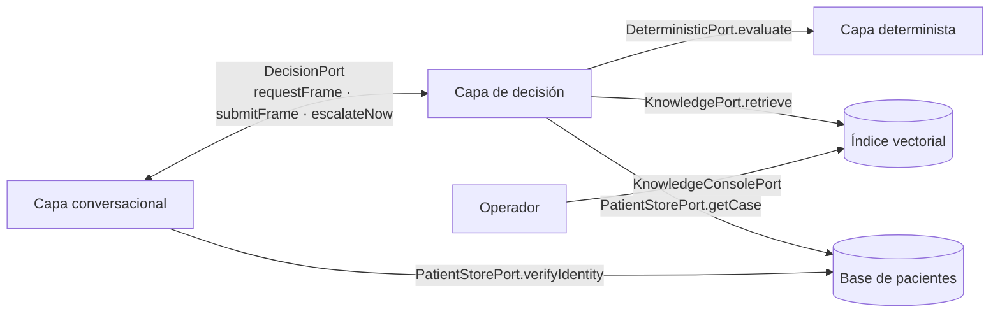
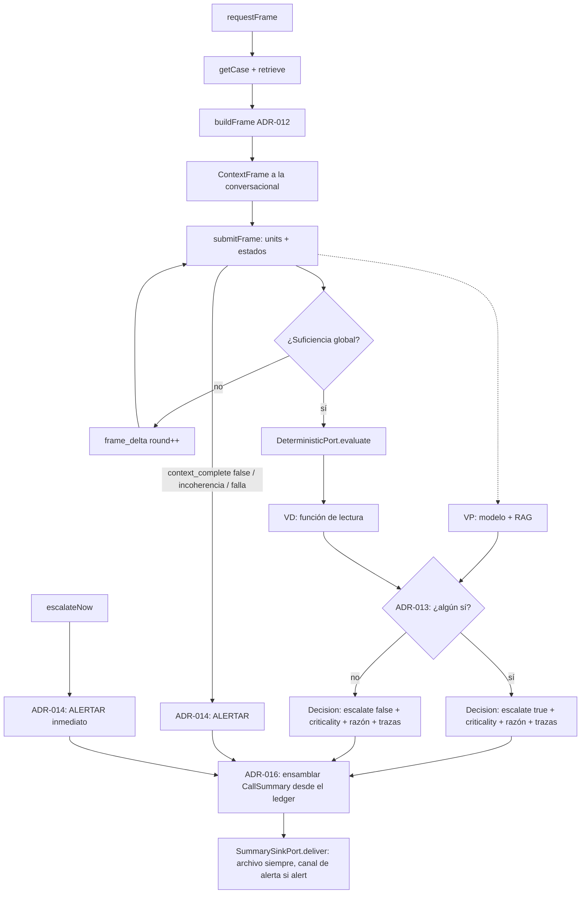

# Especificación Técnica — Capa de Decisión
## Tech Sphere Challenge 2 · El orquestador de la alerta

**Versión:** 1.2 · **Fecha:** 6 de agosto de 2026 · **Actualizado:** 7 de agosto de 2026 · **Autor:** Arcandan López Aburto (Medellín)

**Alcance:** la capa que implementa el lado servidor del `DecisionPort`, aloja el modelo de lenguaje en su rol `decider`, gobierna el bucle de suficiencia global, genera el marco contextual, consume la capa determinista, emite la decisión terminal de alerta y **ensambla y entrega el resumen estructurado de cada llamada**. Cubre la separación conocimiento/estado (RAG vs. base de pacientes), la generación e inferencia del marco contextual, la política de ponderación, la degradación a humano, el **contrato de la consola RAG** con su estándar re-indexable y el **contrato del resumen** (`CallSummary`, `SummarySinkPort`). Incluye ADR-011…ADR-018.

**Fuera de alcance:** la extracción conversacional (`docs/Especificacion-Capa-Conversacional.md`), la evaluación estructural (`docs/Especificacion-Capa-Determinista.md`) y la captura de voz (`docs/Especificacion-Interfaz-Voz.md`).

**Documentos que consume:** `Arquitectura v0.3 - Handoff Analista.md` §3–§5, `docs/Especificacion-Capa-Conversacional.md` §15 (`DecisionPort`, `ContextFrame`, `UnitResult`, `Decision`) y §16 (degradación segura), `docs/Especificacion-Capa-Determinista.md` §6 (`DeterministicPort`, `DeterministicReport`).

---

## 1. Qué es este módulo

Las tres capas ya especificadas convergen aquí. La interfaz convierte voz en texto; la conversacional convierte texto en un marco hidratado con estados; la determinista convierte el marco suficiente en evidencia estructural. Ninguna decide. **Esta capa es la única autoridad de decisión del sistema**: define qué necesita saber (el marco), juzga cuándo alcanza (suficiencia global, ADR-003), y emite el acto terminal — **alertar o no alertar al personal humano**, con razón y trazas.

Sus componentes internos son seis: el **motor de lenguaje** en rol `decider` (tras el puerto `DecisionEngine`; binding fijado por **ADR-017**), el **RAG** (conocimiento clínico recuperable), la **base de pacientes** (estado por caso), el **generador de marcos** (ADR-012), el **ponderador** (ADR-013) y el **ensamblador de resúmenes** (ADR-016). La capa determinista es dependencia externa, invocada una sola vez por sesión tras la suficiencia.

El principio que la ordena es el mismo desdoblamiento de las otras costuras: los contratos que esta capa ofrece y consume están cerrados, así que **es construible contra simuladores** — un `decider` simulado y la taxonomía semilla — y el modelo, el dataset y el contenido clínico se enchufan sin tocarlos. Esa apuesta se verificó el 7 de agosto: llegó un escenario de modelo distinto al previsto y no hubo que mover un solo puerto (ver `docs/Acta-7AGO.md`).

---

## 2. Posición y contratos



Esta capa **implementa** `DecisionPort` (la conversacional lo consume) y **consume** `DeterministicPort`. Introduce tres puertos nuevos: `PatientStorePort` (§4), `KnowledgePort` y `KnowledgeConsolePort` (§8). No introduce ningún esquema nuevo para lo que ya viaja: `ContextFrame`, `UnitResult`, `FrameVerdict` y `Decision` son los tipos de la spec conversacional §15.1, sin re-tipar — la misma regla que rigió `DeterministicRequest.units`.

---

## 3. ADR-011 — Separación conocimiento / estado: el RAG no contiene pacientes

**Contexto.** El sistema maneja dos clases de información: el conocimiento clínico (procedimientos, cuidados post-operatorios, señales de complicación — el "entrenamiento médico") y los datos del paciente concreto (quién es, qué procedimiento tuvo, cuándo, qué se le formuló). La tentación de indexar ambas en el mismo RAG simplifica la infraestructura y hay que rechazarla.

**Decisión.** Dos almacenes con naturaleza, acceso y ciclo de vida distintos:

| | **RAG (conocimiento)** | **Base de pacientes (estado)** |
|---|---|---|
| Contiene | Corpus clínico: procedimientos, cuidados, complicaciones | Identidad, caso quirúrgico, medicación, fechas |
| Naturaleza | General, atemporal respecto al paciente | Contextual, específica de la sesión |
| Recuperación | Similitud semántica (`retrieve`) | Acceso exacto por clave (`getCase`) |
| Actualización | En caliente vía consola (§8) — requisito del reto | Fuera del alcance del reto; el dataset la puebla |
| El paciente aparece | **Nunca** | Siempre |

**Por qué.** *Correctitud*: la recuperación por similitud es el mecanismo equivocado para datos de paciente — un caso "parecido" recuperado por el RAG no es el caso del paciente al teléfono, y mezclarlos habilita exactamente ese error. *Privacidad*: el requisito de conocimiento vivo implica subir y quitar documentos en caliente; si el índice contuviera pacientes, cada operación de consola sería una operación sobre datos personales (RNF-09). *Congruencia*: el paciente es **contextual** — entra a la decisión como marco generado por sesión (ADR-012), no como documento recuperable.

**Consecuencia.** `KnowledgeConsolePort` no admite documentos de tipo paciente; el esquema de metadatos (§8.2) no tiene campo de identidad. La única vía de entrada de datos del paciente a la decisión es `PatientStorePort.getCase`.

---

## 4. `PatientStorePort` — dos vistas, dos consumidores

La spec conversacional §7 exige contrastar identidad "contra la base" sin decir cuál. Es este puerto, con **privilegio mínimo por vista**:

```ts
interface PatientStorePort {
  /** Vista de IDENTIDAD — la única visible a la capa conversacional (F0). */
  verifyIdentity(claim: {
    name: string;
    verifier: { kind: "fecha_procedimiento" | "documento" | "eps"; value: string };
  }): { status: "identificado" | "ambiguo" | "no_encontrado"; patient_ref?: string };

  /** Vista de CASO — exclusiva de la capa de decisión. */
  getCase(patient_ref: string): PatientCase;
}
```

`verifyIdentity` devuelve un veredicto y una referencia opaca, **nunca datos**: sostiene la regla de no divulgación (conversacional §7.3) por construcción — la conversacional no puede filtrar lo que no recibe. `PatientCase` (procedimiento, fecha de cirugía, edad, género, comorbilidades) se deriva de los archivos de perfil del dataset; el puerto es independiente de esa estructura.

> **Corrección del 7-ago — el enum de verificadores.** La versión anterior listaba `fecha_nacimiento`, que **no existe en el dataset**: solo hay `edad`, y la edad no sirve como verificador porque su entropía es casi nula. Se sustituye por `eps`, que sí está en la base y el paciente conoce.
>
> **Orden de preferencia**, que no es arbitrario: `fecha_procedimiento` primero, porque es el más amable con un paciente adolorido y recién operado —lo tiene fresco y no necesita buscar nada—; `documento` segundo, que es el de mayor entropía y el estándar en servicios de salud en Colombia; `eps` tercero y **nunca suficiente por sí solo**, porque el universo de EPS del país es pequeño y adivinable.
>
> **Cuántos verificadores se exigen es política del decisor, no del tipo.** El puerto transporta un verificador por llamada; encadenar dos cuando el primero es débil es decisión de la capa, no del esquema. Y por la decisión de cierre D-8 del acta, un paciente que no logra verificarse **no queda fuera del seguimiento**: la sesión continúa y degrada a humano, con el resumen marcado como no verificado. Quien no puede identificarse puede ser precisamente quien peor está.

---

## 5. ADR-012 — El marco contextual se genera, no se escribe

**Contexto.** La conversacional estableció que el catálogo de unidades lo entrega el decisor **en runtime y específico del paciente** (su spec §8.1). Falta definir de dónde sale. Y hay una carencia que no se puede disimular: el equipo no tiene experto clínico.

**Decisión.** El marco es el producto de una función de generación:

```
buildFrame(PatientCase, KnowledgePort) -> ContextFrame
```

El caso del paciente determina **qué es relevante preguntar** (procedimiento + tiempo transcurrido acotan las complicaciones plausibles); el conocimiento del RAG y el criterio del modelo determinan **las unidades, su léxico y sus red flags**. El marco resultante es el `ContextFrame` ya especificado, sin extensión del contrato.

**Procedencia declarada.** Cada marco registra en el ledger interno de la capa su procedencia: `expert` (un experto validó las unidades) o `inferred` (se derivaron de dataset + corpus + criterio del modelo). **Si no se nos proporciona un experto, se infiere uno de la data entregada** — y esa inferencia se declara, no se disimula: aparece en el informe del reto como límite conocido. Es la misma honestidad estructural de ADR-006 (no somos expertos → no diagnosticamos) aplicada al diseño del marco.

**Consecuencia.** El generador es construible hoy contra un `PatientCase` simulado y un corpus mínimo; el 7 de agosto cambia su **contenido** (dataset real, corpus real, criterio del modelo real), no su forma. El bucle de suficiencia ya especificado (`need_more` + `frame_delta`) es la retroalimentación del marco: el decisor lo enriquece por rondas contra lo que la conversacional consigue.

---

## 6. ADR-013 — Política de ponderación: un sí actúa, dos noes no actúa

**Contexto.** `Arquitectura v0.3` §3.1 dice que la determinista "pondera" la decisión "dentro de un margen definido", sin definir el margen. Este ADR lo precisa. A la vez, ADR-007 prohíbe que el módulo determinista emita bandera de alerta — entonces, ¿qué se pondera exactamente?

**Decisión.** La decisión se compone de **dos votos** producidos dentro de esta capa, combinados por disyunción:

- **VP — voto probabilístico.** El modelo de lenguaje en rol `decider` (ADR-017), con el marco hidratado, los estados de extracción y su evidencia RAG, emite alertar / no alertar con razón — y su lectura de criticidad (ADR-018).
- **VD — voto determinista.** El decisor aplica una **función de lectura declarada** sobre el `DeterministicReport`: un mapeo determinista y versionado de los campos del reporte (lecturas por eje, composiciones activadas, cobertura) a alertar / no alertar. La función vive **en esta capa** — así ADR-007 queda intacto: el módulo determinista entrega evidencia; quien la convierte en voto es el decisor, y esa conversión es auditable regla a regla. Su contenido es **PENDIENTE-7AGO**; su forma (tabla declarada, sin inferencia) queda cerrada aquí.

| VP | VD | Resultado |
|---|---|---|
| alertar | — | **ALERTAR** |
| no alertar | alertar | **ALERTAR** |
| no alertar | no alertar | NO ALERTAR |

**Un sí actúa; solo dos noes no actúan.** El VD tiene poder de disparo unilateral pero **no** poder de veto: no puede apagar una alerta del VP. La asimetría es deliberada — el camino hacia la alerta es ancho y el camino hacia el silencio es estrecho.

**Por qué.** El costo de los errores es asimétrico: un falso positivo cuesta la revisión de un humano; un falso negativo cuesta un paciente sin atender. La disyunción maximiza sensibilidad a costa de especificidad, que es el lado correcto del error en seguimiento post-operatorio. Además reparte la carga de la seguridad: para que el sistema calle, deben coincidir en el silencio un juicio probabilístico y una lectura aritmética independientes entre sí — dos mecanismos con modos de fallo distintos.

**Consecuencia.** `Decision.reason` declara qué voto disparó la alerta (o que ambos callaron); `Decision.traces` lleva `doc_ids` del VP y `rules_fired` del VD, cada voto con su evidencia. **Este ADR precisa el "margen definido" de `Arquitectura v0.3` §3.1**: el margen es exactamente un voto de disparo sin veto.

---

## 7. ADR-014 — A la falla, actúa humano

**Contexto.** La política OR cubre el caso en que ambos votos existen. Falta el caso en que alguno no puede emitirse: contexto incompleto, incoherencia sin resolver, componente caído.

**Decisión.** **Todo estado no decidible degrada hacia el humano, nunca hacia el silencio.** Tres familias, tres tratamientos, un mismo destino:

| Condición | Detección | Efecto |
|---|---|---|
| **Incompletud contextual** | `context_complete: false` — presupuestos agotados, ciclo retroactivo global, unidades `required` suspendidas por degradación | **ALERTAR** con razón `contexto_incompleto`. Es la degradación segura que la spec conversacional §16 enuncia y esta capa aplica |
| **Incoherencia** | Unidades con causa `incoherente`, o contradicción marco ↔ base de pacientes detectada por el VP | **ALERTAR** con razón `incongruencia`. La incoherencia no se resuelve por cuenta del sistema: se reporta |
| **Falla técnica** | `evaluate` falla o `domain_version` discordante; el motor `decider` no responde; el RAG no responde; excepción no manejada en el pipeline | **ALERTAR** con razón `falla_tecnica` y el componente caído. El voto que sí exista acompaña como evidencia parcial |
| **Urgencia** | `escalateNow` (red flag detectado por la conversacional) | **ALERTAR** inmediato, sin bucle y sin determinista, con el `red_flag_id` y el enunciado literal |

**Por qué.** La regla es una sola y se enuncia completa en cuatro palabras: **a la falla, actúa humano**. Un sistema de seguridad cuyo modo de fallo es el silencio no es un sistema de seguridad. Cada rama existe porque hay un modo real de no poder decidir, y en los cuatro la respuesta es la misma: la autoridad vuelve al personal humano, que es el destinatario terminal de todo el sistema.

**Consecuencia.** No existe en esta capa ningún camino de código que termine sin `Decision`. El timeout de cada dependencia es finito y su expiración produce alerta, no reintento indefinido. La única espera sin reloj es la del paciente hablando — y esa la gobierna la conversacional.

---

## 8. ADR-015 y el contrato de la consola RAG

### 8.1 ADR-015 — El documento fuente es la verdad; el índice es derivado

**Contexto.** El requisito de "actualización de conocimiento en tiempo real" exige subir y quitar conocimiento en caliente. Pero el modelo de embeddings depende del anuncio del 7 de agosto (el invariante {modelo, embeddings, corpus} de ADR-002 los ata), y un índice vectorial construido hoy podría no sobrevivir al cambio.

**Decisión.** La consola administra **documentos fuente**, no vectores. El almacén canónico guarda el documento con sus metadatos; el índice vectorial es una **proyección derivada y reconstruible** (`reindex`). Cambiar de modelo de embeddings es re-proyectar el mismo corpus, no re-ingestar conocimiento.

**Por qué.** Es la única forma de definir la consola **hoy** sin apostar al modelo de mañana: todas sus operaciones son sobre documentos y metadatos, agnósticas del embedding. Y es el espejo exacto de ADR-010 al otro lado de la costura: la determinista destila el corpus a taxonomía versionada; el RAG lo proyecta a índice reconstruible. En ambos, la fuente es el documento y lo derivado se regenera.

**Consecuencia.** `reindex` es operación de primera clase, no contingencia. El índice declara con qué `embedding_model` fue construido; una consulta contra un índice de modelo distinto al configurado es error explícito — el mismo guardarraíl que `domain_version` en la determinista.

### 8.2 Estándar de ingesta

Todo documento entra con metadatos obligatorios; sin ellos, la ingesta se rechaza:

```ts
interface SourceDocument {
  doc_id: string;            // estable; es el que viaja en Decision.traces.doc_ids
  title: string;
  kind: "procedimiento" | "cuidados" | "complicaciones" | "farmacologia" | "protocolo";
  lang: string;              // "es"
  origin: string;            // fuente bibliográfica o institucional
  effective_date: string;    // vigencia del conocimiento, no fecha de carga
  body: string;              // texto plano; la conversión desde PDF/otros es previa a la consola
  chunking?: { strategy: "seccion" | "parrafo" | "fijo"; max_tokens?: number };  // default por kind
}
```

`kind` **no admite** ningún tipo de paciente (ADR-011, por esquema). `doc_id` estable es lo que hace auditable la traza: el `doc_ids` de una decisión de hace un mes debe resolver al documento que la sustentó, aunque haya sido retirado después.

### 8.3 Los dos puertos

```ts
/** Runtime — lo consume el VP. Solo lectura. */
interface KnowledgePort {
  retrieve(q: { text: string; k?: number; kind?: SourceDocument["kind"][] }): Array<{
    doc_id: string; chunk_id: string; text: string; score: number;
  }>;
}

/** Administración — lo consume el operador vía consola. Nunca lo toca el runtime. */
interface KnowledgeConsolePort {
  ingest(doc: SourceDocument): { doc_id: string; chunks: number; indexed: boolean };
  retire(doc_id: string): void;      // sale del índice YA; el fuente queda archivado (auditoría)
  list(): Array<{ doc_id: string; title: string; kind: string; status: "indexed" | "retired" }>;
  reindex(embedding_model: string): { docs: number; chunks: number; duration_ms: number };
  status(): { docs: number; chunks: number; embedding_model: string; last_change: string };
}
```

**Semántica de caliente.** `ingest` y `retire` se reflejan en `retrieve` de inmediato, sin reinicio: es la demostración directa del requisito del reto (subir documento → el sistema lo usa en la siguiente sesión; retirarlo → deja de usarlo). La **asimetría con la determinista se declara, no se disimula** (ADR-010): la consola actualiza el RAG en caliente; la taxonomía determinista solo cambia por versión. Son dos garantías distintas y el informe debe decirlo.

**La consola** es la superficie mínima sobre `KnowledgeConsolePort` — CLI o página única. Toda operación queda registrada (quién, qué, cuándo): la historia del corpus es parte de la trazabilidad del sistema, porque una decisión solo es auditable si se sabe qué conocimiento estaba vigente cuando se tomó.

---

## 8b. ADR-016 — El resumen estructurado: ninguna sesión termina sin él

**Contexto.** El reto exige "un resumen estructurado de cada llamada" y la rúbrica lo puntúa como criterio propio. RF-10 lo enunciaba, pero ninguna capa lo había reclamado como responsabilidad: la `Decision` cerraba el flujo y el resumen quedaba implícito — el tipo de omisión que se paga en compuerta. Este ADR lo vuelve explícito y le asigna dueño.

**Decisión.** El resumen es **producto terminal de esta capa**, hermano de la `Decision`: se ensambla **junto con ella**, en el mismo acto, para todo cierre de sesión — tabla OR, degradación (ADR-014) o urgencia (`escalateNow`). La regla de ADR-014 se extiende un eslabón: *ningún camino sin `Decision`* se convierte en *ninguna sesión sin `CallSummary`*.

**El resumen no se infiere: se ensambla.** El `CallSummary` es una destilación determinista del ledger de sesión — misma disciplina que ADR-010 y que la función de lectura VD. Prohibido pedirle al modelo de lenguaje que "resuma la llamada" como mecanismo canónico: la evidencia ya está en el ledger, y un resumen inferido podría contradecirla. El único campo generativo es `narrative` (redacción legible del `decider` para el personal), y es **derivado, opcional y jamás canónico**: si contradice los campos estructurados, valen los campos.

### 8b.1 Contrato `CallSummary`

```ts
interface CallSummary {
  session_id: string;
  generated_at: string;
  patient_ref: string | null;          // opaco; nunca datos del paciente (ADR-011)
  identity_status: "identificado" | "unverified";
  frame: { provenance: "expert" | "inferred"; rounds: number; context_complete: boolean };
  findings: Array<{                    // una entrada por unidad del marco
    unit_id: string;
    state: number;                     // -3..+3, estado final del motor conversacional
    raw: string | null;                // enunciado literal (ADR-004: la evidencia no se destruye)
    normalized: string | number | boolean | null;   // MISMA unión que UnitResult.normalized
    cause?: string;                    // causa tipificada si no se extrajo
  }>;
  decision: {
    escalate: boolean;                 // ADR-013 — la acción (renombrado desde `alert`, 7-ago)
    criticality: Criticality;          // ADR-018 — la lectura de gravedad
    reason: string;
    reason_code: ReasonCode;           // tipificado y obligatorio
    branch: "or" | "degradacion" | "urgencia";
    votes?: { vp?: Vote; vd?: Vote };  // cada voto lleva su acción y su lectura
    traces: { doc_ids: string[]; rules_fired: string[]; vd_rule?: string };
  };
  versions: { domain_version: string; vd_version: string; embedding_model: string };
  metrics?: { latency_ms: number; tokens: number; cost_estimate: number };  // los llena WO-46
  narrative?: string;                  // redacción del decider; derivada, jamás canónica
}

/** Un voto — ADR-013 + ADR-018. Lo emiten por igual el VP (modelo) y el VD (tabla). */
interface Vote {
  escalate: boolean;
  criticality: Criticality;
  reason: string;
}
```

> **Corrección X-7 del 7-ago — `findings[].normalized` era `string | null`.** Se amplía a la unión completa de `UnitResult.normalized`. El tipo estrecho obligaba al ensamblador a serializar una fiebre (`number`) o una adherencia a medicación (`boolean`) a texto, y eso es **re-tipar** — justo lo que el párrafo siguiente prohíbe. Más grave: ADR-016 exige que el ensamblador *ensamble, no transforme*, y una conversión de tipo es una transformación que el ledger no autorizó. Y rompería la verificación contra los 160 casos etiquetados: comparar `"7"` con `7` exige parsear, y parsear es donde viven los errores silenciosos. La prueba de que el tipo estrecho era la anomalía: `UnitResult.normalized` y `ClassHit.origen_valores` ya usan la unión ancha; `CallSummary` era el único sitio que no.
>
> **Guardarraíl que se deriva:** el ensamblador **no ejecuta ninguna conversión de tipo** sobre los campos que copia del ledger. WO-45b lo prueba con un caso que lleve un valor numérico y uno booleano, verificando identidad de tipo además de identidad de valor.

> **Corrección del 7-ago.** `decision.alert` se renombra a **`decision.escalate`** y los votos dejan de ser el par de literales `"alertar" | "no_alertar"` para volverse objetos `Vote`: bajo ADR-018 cada voto transporta **su acción y su lectura de criticidad**, y ambas viajan como evidencia. La tabla OR de ADR-013 sigue operando **solo sobre `escalate`**; `criticality` no se pondera, se registra. `Criticality` y `ReasonCode` se definen en la spec conversacional §15.1 y viven en el módulo compartido de contratos.

Los `findings` reutilizan lo que ya viaja en `UnitResult` — sin re-tipar, la misma regla del §2. El resumen es autocontenido: un humano que solo reciba el `CallSummary` puede auditar la sesión sin acceso al sistema, porque lleva evidencia (`raw`), interpretación (`normalized`, `state`), decisión, trazas y versiones de todo lo que la produjo.

### 8b.2 Entrega: `SummarySinkPort`

```ts
interface SummarySinkPort {
  deliver(summary: CallSummary, destinations: Array<"session_archive" | "alert_channel">):
    { delivered: string[]; failed: string[] };
}
```

**Política de destinos.** `session_archive` recibe **todo** resumen (es el registro auditable y la fuente del informe del reto). `alert_channel` recibe el resumen **cuando `escalate: true`**: el personal alertado no recibe un timbre, recibe el caso — síntomas, razón y fuentes en el mismo artefacto. La implementación concreta de cada destino (archivo, endpoint, panel) es configuración de despliegue, no arquitectura.

**A la falla de entrega, registro — nunca silencio.** Si `alert_channel` falla, la alerta ya fue emitida por la `Decision` y el resumen persiste en `session_archive` con la falla registrada; la entrega se reintenta o se reporta, pero el resumen jamás se pierde por un destino caído. El archivo es local a la capa: no tiene modo de fallo remoto.

**Consecuencia.** El ensamblador es construible hoy contra el ledger de sesión existente; su contenido clínico llega solo del marco y las trazas (nada nuevo PENDIENTE-7AGO salvo lo ya pendiente en ellas). La consola/demo lee de `session_archive` — es la evidencia directa del criterio "resumen estructurado" en el video.

---

## 8c. ADR-017 — Binding del modelo: la lista cerrada y la ruta local

> ⚠️ **Su binding fue supersedido por ADR-021 (§8c-bis) el mismo 7 de agosto**, tras la respuesta de la organización que autorizó los modelos sucesores. Este ADR **se conserva íntegro y sigue vigente** en todo lo demás: la lista cerrada, el criterio de elección —español por encima de razonamiento—, la decodificación restringida por esquema, un solo modelo para los dos roles, y la escalera de escape. La ruta local que fija aquí pasó de primaria a **respaldo declarado**, y sus razones siguen siendo las que la sostienen en ese papel.

**Contexto (7-ago).** La ficha técnica no fijó un modelo único, como se había supuesto, sino una **lista cerrada de cuatro**: Gemini 1.5 Flash, Llama 3.1 70B vía Groq, Llama 3.2 (1B/3B) local y Phi-3.5 Mini 3.8B local. La compuerta G3 **descalifica** —no despuntúa— si el modelo de lenguaje del agente está fuera de la lista, y se verifica "contra tus dependencias, tu configuración y tu código".

Al validar la lista se encontró que **dos de las cuatro opciones ya no existen**: toda la familia Gemini 1.5 está apagada —comprobado contra el listado real de una clave válida, donde el modelo disponible más antiguo es 2.0 Flash— y `llama-3.1-70b-versatile` fue desmantelado en Groq. La lista efectiva son los dos modelos locales en CPU.

**Decisión.** El agente corre **`llama3.2:3b` sobre Ollama, en local, cuantizado a q5_K_M u q8**, y el **mismo modelo sirve los dos roles** de ADR-002 (`interviewer` y `decider`).

**Por qué este modelo y no Phi-3.5.** El criterio que decide no es la capacidad de razonamiento sino la **calidad del español**, porque el rol que conversa con un paciente asustado es el que la rúbrica evalúa en tono y registro, y porque el razonamiento estructural lo absorbe la capa determinista: las magnitudes del marco son numéricas y comparables sin criterio inferencial pesado. Llama 3.2 se entrenó con soporte multilingüe declarado y produce un español coloquial y cálido; Phi-3.5 Mini sigue instrucciones mejor pero su entrenamiento fuertemente sintético y anglocéntrico produce un español correcto y rígido, con calcos estructurales del inglés. Para un decisor eso sería indiferente; para el entrevistador es el defecto exacto que penaliza la rúbrica.

**Por qué un solo modelo para ambos roles.** ADR-002 lo justificaba por congruencia representacional. Bajo G3 adquiere una segunda justificación, más dura: con la compuerta verificándose contra código y dependencias, **una sola dependencia de modelo en todo el repositorio hace la conformidad auditable de un vistazo**. Deja de ser una preferencia de diseño y pasa a ser una defensa.

**Por qué cuantización alta.** El stack técnico del reto dimensiona sobre 8 GB de RAM, lo que empuja a q4. Con 16 GB hay margen para q5_K_M o q8 del mismo 3B (2,6–3,4 GB), y en modelos pequeños la cuantización se nota en fidelidad de salida y naturalidad. Es la mejora de calidad más barata disponible: mismo modelo, misma lista permitida, mejor conversación.

**Debilidad conocida y su compensación.** El punto flojo real de un modelo pequeño no es el español ni el razonamiento: es la **fiabilidad del formato de salida**. La respuesta original de este ADR era la decodificación restringida por esquema, que convierte un problema de capacidad del modelo en uno de configuración del decodificador.

> ⚠️ **Corrección del 7-ago — la garantía cambia de sitio.** La medición encontró que **`llama-3.3-70b-versatile` en Groq no admite `json_schema`, solo `json_object`**. En la ruta primaria, por tanto, la promesa de este ADR —*"imposible por construcción, no improbable por prompt"*— **no se cumple con el decodificador**. Acertó 20 de 20 en el banco, pero **acertar sin garantía no es lo mismo que acertar con ella**, y ese era precisamente el punto.
>
> **La garantía no se ablanda: se mueve una capa arriba.** Pasa de *"el decodificador no puede emitir inválido"* a **"el sistema no puede aceptar inválido"**:
>
> 1. Toda salida estructurada del modelo cruza el **validador recursivo del módulo de contratos**. Sin excepción y en las dos rutas.
> 2. Una salida que no valida se **reintenta de forma acotada**, con el error de esquema en el reintento.
> 3. Agotados los reintentos, **la unidad queda sin normalizar** — `normalized: null`, con su `raw` intacto por ADR-004— y eso degrada al humano por ADR-014.
>
> Es decir: **la incapacidad de producir salida válida es un resultado declarado, no una excepción.** Es la misma filosofía de ADR-009 —la no evaluabilidad es resultado, no vacío— aplicada a otra capa.
>
> **Y así es más fuerte que la versión original**, porque **no depende del proveedor**: vale en Groq con `json_object`, en cualquier ruta que ofrezca `json_schema`, y en local. Si Groq habilita `json_schema` para este modelo, se usa **además**, no en lugar de: el decodificador restringido reduce los reintentos, el validador es el que da la garantía.

Ninguna extracción de unidad ni ningún voto del decisor depende de que el modelo "sepa" emitir JSON.

**Alternativas evaluadas y descartadas.**

| Alternativa | Por qué se descarta |
|---|---|
| Gemini 1.5 Flash | Apagado. Devuelve 404 |
| Llama 3.1 70B vía Groq | Desmantelado en Groq |
| Phi-3.5 Mini 3.8B | Español rígido y anglocalcado en el rol que conversa. Queda como **alternativa a medir**, no descartada del todo |
| Llama 3.2 1B | Insuficiente en fidelidad de salida estructurada. Queda como **escape de latencia**, no como plan |
| Dos modelos distintos, uno por rol | Ambos serían de la lista, pero duplica RAM y arranque, contradice la premisa del stack ("son alternativas entre sí, no componentes simultáneos") y vuelve opaca la verificación de G3 |
| Un LLM fuera de la lista para el rol conversacional | **Riesgo de descalificación.** G3 dice "el modelo de lenguaje **de tu agente**", sin distinguir roles, y verifica por código. Lo libre es STT, TTS, embeddings, base vectorial y orquestación — no un segundo LLM |

**Consecuencia.** El binding vive detrás de `DecisionEngine` y `ConversationalEngine`, que no cambian. Si la organización amplía la lista —consulta enviada con evidencia de los dos modelos apagados—, migrar es **una variable de entorno**, no una reescritura: exactamente el escenario para el que se diseñó el aislamiento del modelo. La ruta local es además la única que satisface G2 sin credenciales de terceros y la sesión evaluada sin dependencia de red.

**Escalera de escape de latencia** — *reordenada el 7-ago con el desglose prefill/generación*. El término que domina el TTFT es el **prefill**, no la generación, y eso cambia qué escalones sirven:

| Orden | Escalón | Por qué ahí |
|---|---|---|
| **1** | **Reordenar el prompt** (ADR-023): prefijo estable cacheable, cola volátil al final | Ataca el prefill directamente, es gratis y **beneficia también a la ruta nube** relajando el techo de tokens por minuto |
| **2** | **Plantillas del motor de estados** para generar las preguntas, con el LLM solo extrayendo y reformulando | Reduce llamadas al modelo por turno. También ataca el término correcto |
| **3** | `llama3.2:1b` | Último recurso. Cuesta fidelidad de salida estructurada |

> **Retirado: bajar la cuantización.** Era el primer escalón de la versión original y **ataca el término equivocado**: una cuantización menor acelera la *generación*, mientras que el problema medido está en el *prefill*. Mandaba a gastar tiempo en el escalón inútil antes que en los dos que sirven. Se retira de la escalera y de la línea de corte C5 del plan.

**Límite.** Este ADR fija el binding, no el criterio clínico. Nada de lo decidido aquí toca ADR-011, ADR-013, ADR-014 ni ADR-016.

---

## 8c-bis. ADR-021 — Ruta nube primaria, local como respaldo · **supersede el binding de ADR-017**

**Contexto (7-ago, tarde).** ADR-017 fijó la ruta local porque dos de los cuatro modelos permitidos estaban apagados y no quedaba alternativa de nube. Se consultó a la organización adjuntando la evidencia. Su respuesta —archivada textual en `docs/Respuesta-Organizacion-7AGO.md`— autoriza migrar a **las versiones o iteraciones más recientes liberadas por los proveedores de dichos modelos, es decir, a sus sucesores**.

Eso reabre la nube, y la verificación posterior encontró un sucesor de linaje exacto: **`llama-3.3-70b-versatile` sigue vivo como modelo de producción en Groq** —280 t/s, 131k de contexto—; la deprecación anunciada en junio de 2026 no se ejecutó. `Llama 3.1 70B → Llama 3.3 70B` es el mismo proveedor, la misma familia, el mismo tamaño y el mismo host: no hay lectura en la que no sea un sucesor. La familia Gemini Flash también está viva y verificada contra el listado real de una clave.

**Decisión.** El sistema corre sobre un **modelo de nube de linaje sucesor** como ruta primaria, con la **ruta local de ADR-017 conservada como respaldo declarado**. El binding sigue siendo una variable de entorno detrás de `DecisionEngine` y `ConversationalEngine`; ambas rutas usan un solo modelo para los dos roles.

La elección entre los dos candidatos de nube **se decide midiendo, no argumentando** — banco de pruebas en `docs/Arranque-Sesion-Paso-0bis.md` — sobre cuatro medidas: exactitud de extracción, naturalidad del español a ciegas, latencia y **estabilidad de decisión**. El criterio dominante es la conversación, porque la extracción es lo que alimenta todo lo demás: un dato mal normalizado envenena la recuperación y el voto sin que nadie se entere (ADR-002).

**Por qué esto no es volver atrás.** ADR-017 no se equivocó: decidió correctamente con la información disponible y **diseñó explícitamente para este momento** —"si la organización amplía la lista, migrar es una variable de entorno"—. Que la migración cueste un adaptador y no una reescritura es la prueba de que el aislamiento del modelo valía lo que costó. La ruta local no se descarta: se degrada de primaria a respaldo, y su trabajo ya hecho no se pierde.

**Por qué se conserva el respaldo local.** Dos razones concretas, ninguna teórica:

1. **Compuerta 2.** El respaldo hace el arranque a prueba de credenciales: si la key falla o el evaluador no quiere crear una, existe una ruta sin credencial alguna. G2 solo contempla **una** corrección por credenciales rotas, con 24 horas y un reintento; tener una salida que no depende de terceros convierte esa única bala en algo que no hay que gastar.
2. **La demo del 5 de septiembre.** La deprecación de Llama 3.3 está *anunciada* aunque no ejecutada. Si se ejecuta antes del evento de premiación, la sustentación en vivo —donde el panel dicta qué probar y **no se acepta demo pregrabado**— se caería sin remedio. El respaldo local es el seguro de esa fecha.

**Consecuencia sobre el guardarraíl de temperatura.** El rol `decider` corre con **`temperature: 0`** o el mínimo que el proveedor admita; el rol `interviewer`, no —ahí una variación pequeña favorece la naturalidad, que es lo que la rúbrica evalúa en tono y registro—.

Pero conviene ser exacto sobre qué garantiza eso: **temperatura cero no produce determinismo en un modelo hospedado.** El batching y el hardware introducen variación aunque el muestreo sea codicioso. **La consistencia del sistema no viene del modelo y nunca vino de él**: viene del segundo voto de ADR-013, que es una tabla declarada y por tanto idéntica ante el mismo caso, y de la disyunción sin veto, que impide que la mitad probabilística apague a la mitad reproducible. Este ADR no cambia esa arquitectura; explicita por qué era necesaria.

**Consecuencia sobre las métricas.** Se añade una métrica que la rúbrica no pide y que responde directo a su criterio sobre situaciones ambiguas: **estabilidad de decisión** — un subconjunto de casos se corre cinco veces cada uno y se reporta cuántas veces cambió la decisión. Un sistema que decide distinto sobre el mismo cuadro no es auditable, y medirlo es la única forma de afirmar que el nuestro no lo hace.

**Consecuencias operativas menores.** Desaparece `ollama pull` del reloj de la compuerta 2 en la ruta primaria; las líneas de corte **C5** (bajar cuantización) y **C6** (preguntas por plantilla) dejan de aplicar a esa ruta y quedan vigentes solo para el respaldo; el costo por llamada pasa de extrapolado a **real**, lo que fortalece el segundo criterio de desempate del reto; y la CPU queda libre, de modo que la síntesis de voz ya no compite con la inferencia.

**Obligación declarada.** El informe final debe citar la respuesta de la organización con fecha y remitente, junto al nombre del modelo usado. Un jurado que compare contra la lista publicada va a encontrar un nombre que no está en ella; sin la cita al lado, eso es una conversación de descalificación.

### 8c-bis.1 Guarda de G3: **una por ruta**, no una sola

Con dos rutas, la guarda que valida el nombre del modelo contra la lista permitida **no puede ser única**: valida un identificador contra el catálogo de un proveedor concreto, y los catálogos no son intercambiables. Una guarda que conozca nombres de Ollama es inútil frente a un identificador de nube, y una lista que mezcle ambos no protege de nada porque acepta cualquier cosa de cualquiera de los dos mundos.

**Regla.** Cada adaptador de ruta lleva **su propia guarda contra su propia lista**, y **ningún adaptador arranca si su modelo configurado no está en ella**. El fallo es al levantar el proceso, no al primer turno: un sistema que descubre en producción que está usando un modelo no permitido ya falló la compuerta.

**El riesgo concreto que esto cierra.** Al migrar de local a nube quedó protegida solo la ruta local —la del respaldo— porque era donde ya vivía la guarda. **La ruta primaria, que es la que se entrega y la que el jurado ejecuta, quedó sin protección estructural.** Es el modo de fallo más incómodo posible: la salvaguarda existe, se ve en el código, y cubre justo la ruta que menos importa.

**Verificación.** Un test por ruta que configure un modelo fuera de lista y compruebe que el arranque falla. Y la regla de auditoría de ADR-017 sigue en pie: **una sola constante de modelo por adaptador**, sin SDK de proveedor, sin una segunda URL de inferencia en ningún otro archivo.

### 8c-bis.2 Caracterización medida del respaldo local — ✅ **RESUELTA en §8c-bis.3**

> **Corrección del 7-ago (tarde). La versión anterior de este apartado afirmaba que el respaldo local no falla la compuerta G4. Era falso, y el error merece quedar escrito.**
>
> La afirmación se apoyaba en un dato correcto —**el 96 % del reloj de sesión se va en el turno de decisión** (hallazgo H8 de la rebanada)— y en una inferencia inválida: que si la decisión se lleva el 96 %, los turnos de entrevista son rápidos. **No lo eran: no existían.** El arnés que produjo esa cifra leía los turnos de entrevista de un array de cadenas fijas en el mock (`mock-backend/server.js`, marcado `SIMULADO — sustituye WO-14..WO-17`), sin ninguna llamada al modelo. El desglose de esos 43,5 s no tiene una partida de turno de entrevista pequeña: **no tiene ninguna**.
>
> Es el error clásico con métricas de porcentaje: se aceptó el numerador sin preguntar qué contenía el denominador. Queda registrado porque el mismo arnés seguirá produciendo porcentajes durante toda la construcción.

**Los números reales del turno de entrevista**, medidos en el banco sobre `llama3.2:3b` q4_K_M —el mejor de los candidatos locales—, con prompts de 398→738 tokens que crecen con la historia:

| Turno | Unidad en foco | TTFT | Total |
|---|---|---|---|
| 1 · apertura | dolor | **9,99 s** | 14,85 s |
| 4 | fiebre | 13,59 s | 18,49 s |
| 10 · cierre | herida | 16,54 s | 22,22 s |

**La conclusión se invierte, y cae justo donde más duele.** El argumento anterior decía que G4 se verifica con "saludo y una pregunta trivial" y que eso nunca alcanza el turno de decisión. Es cierto — pero **un saludo es un turno de entrevista**. Con la historia vacía, el local pone el primer token a 9,99 s y termina a 14,85 s, y encima hay que sumar STT y TTS.

> **El respaldo no falla G4 *a pesar* del turno de decisión. Falla G4 en el turno exacto que G4 examina.**

**Qué sobrevive de este apartado.** Los 34–43 s de sesión completa, los ~12,5 s del turno de suficiencia y la motivación de **ADR-022** siguen bien medidos: son del camino de decisión. Lo que cae es solo la inferencia sobre los turnos de entrevista y todo lo que colgaba de ella.

**Consecuencia sobre el papel del respaldo.** Los dos trabajos que este ADR le asignaba quedaron **retirados** tras la medición (§8c-bis.3), porque no puede hacer ninguno:

- *Salida de G2 sin credenciales:* deja de ser una salida. Si el evaluador toma esa ruta, el sistema levanta y **falla una compuerta distinta**. Ofrecer un camino documentado que conduce a un fallo es peor que no ofrecerlo.
- *Seguro del 5 de septiembre:* si el modelo primario desaparece antes del panel, caer al local significa sustentar en vivo a quince segundos por turno. No es un seguro; es una forma más lenta de perder.

### 8c-bis.3 Resolución — el respaldo se retira de sus dos papeles

*Medición de ADR-023 cerrada el 7-ago por la tarde (`bench/RESULTADOS.md` §5-bis). El criterio se fijó **antes** de medir, y se aplica sin ablandarlo.*

| Turno | TTFT orden anterior | TTFT con ADR-023 | Prefill |
|---|---|---|---|
| 1 · apertura | 12,08 s | **10,93 s** | −11,0 % |
| 4 | 10,17 s | **8,63 s** | −19,4 % |
| 10 · cierre | 12,81 s | **8,02 s** | −46,4 % |

El reordenamiento funciona y el efecto crece con el turno, que es lo que predice el mecanismo. Pero **los tres quedan por encima de 6 s**, y el peor es la apertura — el turno exacto que G4 examina.

**Decisión: el respaldo local pierde sus dos papeles.**

- **Ya no es la salida de G2 sin credenciales.** Un camino documentado que levanta el sistema y luego falla otra compuerta es peor que no ofrecerlo. La credencial de la ruta primaria es gratuita, sin tarjeta y se obtiene en un minuto; G2 además contempla una corrección por credenciales rotas.
- **Ya no es el seguro del 5 de septiembre.** Sustentar en vivo a diez segundos por turno no es un seguro.

**Qué se conserva, y con qué nombre.** ~~La ruta local sigue existiendo como **modo degradado documentado**~~ — **retirada por completo el 8-ago, ver §8c-bis.4.**

---

### 8c-bis.4 Retiro definitivo de la ruta local — ADR-025

*Decisión del director, 8-ago. Cierra lo que §8c-bis.3 dejó a medias.*

§8c-bis.3 le quitó al respaldo local sus dos trabajos pero lo conservó como "modo degradado". **Un componente sin trabajo no es una reserva: es superficie que se mantiene sola.** Estaba costando un motor en la rebanada, una ruta en la guarda de G3, una sección de README y —esto es lo que lo decide— **`ollama pull` dentro del reloj de G2**.

**El supuesto que lo sostenía era falso.** Se conservaba para ofrecer un arranque sin credenciales. El texto literal de G2 dice *"≤15 min siguiendo el README, **credenciales incluidas**"*, y el reto contempla además una corrección por credenciales rotas (24 h, un reintento). **El reto da por supuesto que hay credenciales.** No existía el requisito que la ruta local protegía, y a cambio introducía un riesgo real —la descarga del modelo dentro del cronómetro— que la propia Acta ya había señalado (§4 D-10).

**Decisión.** La ruta local se retira del código, del README y de la guarda. **La estructura de listas por ruta de §8c-bis.1 se conserva íntegra** — es el arreglo de H16 y sigue protegiendo las dos rutas de nube.

| Se elimina | Se conserva |
|---|---|
| `OllamaDecisionEngine` de la rebanada | La guarda de G3 **por ruta**, con sus listas separadas |
| La lista de la ruta local en `MODELOS_PERMITIDOS` | Groq (primaria) y Gemini Flash (seguro del 5-sep) |
| `ollama pull` del guion de arranque y del reloj de G2 | La caracterización medida del respaldo en `bench/`, como evidencia |
| La sección de modo degradado del README | El relato del retiro en el informe |

**Esto se documenta como retiro, no como olvido.** *"Se evaluó como respaldo, se midió, falló G4 en el turno que G4 examina y se retiró"* es una decisión de ingeniería con evidencia detrás, y suma en el criterio de proceso. Los números de `bench/` no se borran: son lo que sostiene la afirmación.

**Corolario sobre los *embeddings*.** El RAG no puede quedar dependiendo de un servicio que ya no existe. G5 exige vectorizar **en caliente, delante del jurado**, un documento arbitrario; el índice preconstruido no cubre ese caso. La vía elegida es un ***embedding* en proceso** (transformers.js / ONNX, modelo multilingüe pequeño): cero credenciales, cero servicios, funciona en español y añade megabytes al arranque, no un servidor. Un modelo de *embedding* **no es "el modelo de lenguaje de tu agente"**, así que no toca G3 — se declara en el informe de todos modos.

**Candidato y su límite duro.** `multilingual-e5-small` cuantizado (~120 MB, 384 dimensiones) es el punto de partida; alternativa `paraphrase-multilingual-MiniLM-L12-v2`. **Verificar que el identificador resuelve antes de construir sobre él** — misma disciplina que se aplicó al linaje del LLM.

Dos propiedades del modelo que son restricciones de diseño, no detalles:

1. **Ventana de 512 tokens.** Un fragmento más largo **se trunca en silencio** y su cola no queda representada en el vector. Eso pone **techo duro al tamaño de chunk**: la medición de calidad de recuperación se corre a **150 / 300 / 450 tokens**, no a 800, porque 800 no sería un chunk grande sino un chunk de 512 con la cola perdida.
2. **La familia e5 exige prefijos** —`query:` en la consulta y `passage:` en el fragmento—. Omitirlos no falla: degrada la recuperación en silencio, que es el peor modo.

**Qué se registra en el índice.** No basta `embedding_model`. Los vectores cambian también con la **cuantización** y con la **convención de prefijos**, así que las tres cosas se registran juntas y el desajuste de cualquiera falla explícito. Registrar solo el nombre del modelo dejaría exactamente el hueco de "resultados silenciosamente incomparables" que este diseño quiere cerrar.

**Adónde se muda el seguro del 5 de septiembre — y es mejor sitio.** A una **segunda estirpe de nube**: la familia Gemini Flash es también sucesor de linaje (`docs/Respuesta-Organizacion-7AGO.md` §4), quedó verificada funcionando, y su único límite es la cuota del nivel gratuito, que la facturación levanta. Si el modelo primario se deprecara antes del panel, migrar es **una variable de entorno y se conserva G4** — que es exactamente lo que el respaldo local no podía conservar. La guarda de G3 por ruta (§8c-bis.1) ya contempla esa tercera lista.

---

## 8c-ter. ADR-022 — La suficiencia se decide por predicado; el modelo solo desempata

**Contexto (7-ago, hallazgo H10 de la rebanada vertical).** La medición del bucle mostró que **la llamada de suficiencia cuesta ~12,5 segundos para producir un booleano**, y que domina el reloj de la sesión. La observación que la acompaña es la que importa: **ADR-003 asigna al decisor la *autoridad* sobre la suficiencia global; nunca dijo que el *mecanismo* fuera inferencia.** Se dio por sentado que "el decisor juzga" significaba "el modelo juzga", y no es lo mismo.

**Decisión.** La suficiencia global se resuelve con un **predicado determinista sobre el marco**, y el modelo se consulta **solo cuando el predicado no basta**. La política es deliberadamente **asimétrica**:

| Predicado sobre el marco | Qué ocurre |
|---|---|
| Alguna unidad `required` **no** cerrada, o sin `coverage_met` | **`need_more` inmediato. No se llama al modelo.** La respuesta ya se conoce |
| Todas las `required` cerradas con cobertura | **Se consulta al modelo**, que puede devolver `need_more` igual |

**Por qué asimétrica y no simplemente determinista.** Completitud estructural **no es suficiencia clínica**. Un marco puede estar completo y aun así merecer otra ronda —un dolor de 8 sobre 10 reportado con `state` bajo, una unidad `cubierta_condicionada` con dependencias abiertas—, y ese juicio sí es del modelo. Lo que se elimina es la llamada cuya respuesta era mecánicamente conocida de antemano.

**Por qué esto no toca ADR-003.** La autoridad sigue siendo íntegramente del decisor: un predicado declarado que vive en esta capa **es** esta capa decidiendo. Lo que cambia es que parte de esa decisión deja de ser probabilística y pasa a ser auditable — en la misma dirección que ADR-013 y por la misma razón.

**Consecuencia sobre el reloj.** En el bucle, **la mayoría de las rondas son insuficientes**: son precisamente las que motivan otra ronda. Ese es el caso que el predicado cortocircuita, así que el ahorro cae donde más pesa. Y el turno terminal —el único que sí consulta— es el que se puede enmascarar conversacionalmente.

**Consecuencia sobre la explicabilidad.** Cada `need_more` producido por el predicado trae consigo **qué unidad concreta faltaba**, en vez de una decisión del modelo sin desglose. El `frame_delta` deja de ser una inferencia sobre qué repreguntar y pasa a ser una consecuencia directa del estado — que es exactamente lo que la rúbrica premia cuando pregunta si el agente **indaga antes de decidir**.

**Guardarraíl.** El predicado **no puede declarar suficiencia por sí solo**. Nunca hay un camino en que el marco se declare suficiente sin que el modelo haya opinado: el atajo existe solo hacia `need_more`, jamás hacia `sufficient`. Un predicado que pudiera cerrar el bucle sería una regla estructural decidiendo un asunto clínico, y eso es precisamente lo que ADR-006 y ADR-007 prohíben en la otra capa.

**Dónde se implementa.** WO-42 (servidor `DecisionPort` y bucle de suficiencia). **No se implementa en la rebanada vertical**: allí el andamio hace que el 100 % de las rondas sean insuficientes, de modo que el predicado cortocircuitaría siempre y el ahorro medido saldría inflado. La medición honesta exige extracción real.

---

## 8d. ADR-018 — La criticidad es ternaria; el escalamiento sigue siendo binario

**Contexto (7-ago).** El modelado asumía una salida binaria: alertar o no alertar. El dataset del reto etiqueta cada caso con `label_ground_truth` ∈ {`verde`, `amarillo`, `rojo`}, constante dentro de cada `caso_id`, y la rúbrica evalúa *"cómo clasifica el agente la criticidad de lo que reporta el paciente, en situaciones donde escalar es claramente lo correcto, donde claramente no lo es, y **en situaciones ambiguas**"*. El amarillo es precisamente esa zona ambigua, y es donde se juega el criterio.

**Decisión.** `Decision` transporta **dos campos distintos que no se colapsan**:

- **`criticality`** ∈ {`verde`, `amarillo`, `rojo`} — la lectura de gravedad del cuadro. Es lo que se contrasta contra `label_ground_truth`.
- **`escalate`** ∈ {true, false} — la acción. Es lo que produce el ponderador OR de ADR-013, sin cambio alguno.

El mapeo por defecto es **`rojo` ⇒ escalar · `verde` ⇒ no escalar · `amarillo` ⇒ escalar con razón `vigilancia`**, y lo emiten ambos votos: el VP declara su criticidad con razón, el VD la deriva de la función de lectura declarada.

**Por qué no colapsarlo a un booleano.** Colapsar perdería el amarillo, que es el 16 % de los casos y el único tramo donde la decisión es interesante. Además haría imposible medir contra la etiqueta de referencia: con 160 casos anotados podemos evaluar la clasificación antes de la sesión evaluada, y eso solo funciona si el sistema emite en el mismo vocabulario que el dataset.

**Por qué el amarillo escala.** Por coherencia con ADR-013 y con la asimetría clínica que la propia rúbrica declara —*"el falso negativo es la falla catastrófica"*—. Un amarillo que no escala es un falso negativo potencial; un amarillo que escala cuesta la revisión de un humano. La razón `vigilancia` distingue en el resumen una alerta de seguimiento de una alerta de urgencia, de modo que el personal no recibe todo con el mismo timbre.

**Por qué esto no toca ADR-013.** El ponderador sigue siendo idéntico: dos votos, disyunción, un sí actúa y el VD no tiene veto. Lo que cambia es que cada voto ahora transporta también su lectura de criticidad, que viaja como evidencia. La tabla OR opera sobre `escalate`, no sobre `criticality`.

**Consecuencia.** `CallSummary` (ADR-016) incorpora `criticality` junto a la decisión, y el archivo de sesión queda directamente contrastable contra el dataset etiquetado. La función de lectura VD (WO-43) emite tres niveles en vez de dos; su forma —tabla declarada, sin inferencia— no cambia.

---

## 9. Flujo interno de la decisión



Cuatro lecturas. La suficiencia global es **previa** a los votos: no se vota sobre contexto que el propio decisor no declaró suficiente. Los caminos de ADR-014 **no pasan por la tabla OR**: la degradación no es un voto, es un cortocircuito hacia la alerta. `escalateNow` ni siquiera espera al bucle — es el único camino que produce `Decision` sin marco cerrado. Y **los cuatro cierres convergen en el resumen** (ADR-016): no existe salida del flujo que no pase por `CallSummary` y su entrega.

---

## 10. Guardarraíles

**Ningún camino sin `Decision`.** Verificable por revisión del pipeline: toda rama, incluida toda excepción, termina en una `Decision` con razón.

**El VD no se infiere.** La función de lectura VD es una tabla declarada sobre campos del reporte; prohibido delegarla al modelo de lenguaje. Si la lectura del reporte determinista fuera probabilística, el sistema perdería el segundo mecanismo independiente que justifica ADR-013.

**Sin veto.** No existe configuración que permita a un voto negativo apagar un voto positivo. Cualquier propuesta de "el modelo puede descartar el disparo determinista" debe pasar por un ADR que revierta ADR-013 explícitamente.

**Cobertura antes del silencio.** Antes de emitir `escalate: false`, el decisor verifica `DeterministicReport.coverage`: si unidades `required` quedaron no evaluadas, el caso es incompletud (ADR-014), no silencio. El falso negativo por omisión — el error más caro — queda bloqueado por regla, no por criterio.

**Trazas obligatorias.** `Decision` sin `doc_ids` (cuando hubo VP) o sin `rules_fired` (cuando hubo VD) es inválida por esquema. La razón verbalizada (`reason`) y la evidencia (`traces`) viajan siempre juntas.

**Ninguna sesión sin resumen.** Todo cierre —OR, degradación o urgencia— ensambla y entrega su `CallSummary` (ADR-016). El resumen **se ensambla del ledger, no se infiere**: el modelo de lenguaje no es fuente de ningún campo estructurado; `narrative` es derivado y jamás canónico. Un `CallSummary` sin `decision.traces` o sin `findings` cuando hubo marco es inválido por esquema.

**Métricas del reto.** Esta capa es donde se instrumentan latencia por componente, tokens del modelo y costo por sesión — los números que el README del reto exige. Se recogen sobre la marcha, no se reconstruyen al final.

---

## 11. Forma cerrada hoy · contenido pendiente

| Elemento | Estado |
|---|---|
| Separación RAG / base de pacientes | ✅ Cerrado — ADR-011 |
| `PatientStorePort` (dos vistas) | ✅ Cerrado — §4 |
| Generación e inferencia del marco | ✅ Cerrado — ADR-012 |
| Política de ponderación OR, sin veto | ✅ Cerrado — ADR-013 |
| Degradación a humano (cuatro ramas) | ✅ Cerrado — ADR-014 |
| Estándar re-indexable y consola RAG | ✅ Cerrado — ADR-015, §8 |
| Resumen estructurado y entrega (`CallSummary`, `SummarySinkPort`) | ✅ Cerrado — ADR-016, §8b |
| Flujo interno y guardarraíles | ✅ Cerrado — §9, §10 |
| Binding del modelo (`DecisionEngine`) | ✅ Cerrado — ADR-017 + **ADR-021** |
| Criticidad ternaria y `reason_code` tipificado | ✅ Cerrado — ADR-018 |
| Estructura de `PatientCase` | ✅ Cerrado — la fija el dataset del reto |
| Corpus clínico del RAG | ✅ Cerrado — 107 PDF, clasificados por contenido |
| Modelo de embeddings | ✅ Cerrado — stack libre por la ficha técnica |
| **Contenido del generador de marcos** (léxico y red flags reales) | 🔲 Abierto — insumo disponible en `capa2_ruidosa` |
| **Contenido de la función de lectura VD** | 🔲 Abierto — calibrable contra los 160 casos etiquetados |
| **Criterio de suficiencia global** | 🔲 Abierto |

**Construcción contra simuladores.** La capa se construye hoy con: un `decider` simulado (guion de suficiencia y VP), la taxonomía semilla de la determinista, un `PatientCase` sintético y un corpus mínimo de dos o tres documentos para ejercitar consola e índice. Igual que el mock-backend y el decisor simulado de las otras capas: forma real, contenido desechable.

---

## 12. Criterios de aceptación

1. `verifyIdentity` nunca devuelve datos del paciente: solo veredicto y `patient_ref` opaco.
2. Ninguna consulta a `KnowledgePort` interviene en la identificación ni en el acceso al caso; ningún documento con datos de paciente puede ingestarse (rechazo por esquema).
3. `buildFrame` produce un `ContextFrame` válido de la spec conversacional §8.2 y registra su procedencia (`expert` | `inferred`).
4. Con VP = no y VD = sí, la decisión es alertar; con VP = sí y VD = no, la decisión es alertar; solo con doble no la decisión es no alertar.
5. No existe configuración que produzca veto: verificable por ausencia de rama en el ponderador.
6. `context_complete: false` produce alerta con razón `contexto_incompleto`, sin pasar por la tabla OR.
7. La caída simulada de cada dependencia (determinista, `decider`, RAG) produce alerta con razón `falla_tecnica` dentro del timeout declarado.
8. `escalateNow` produce `Decision` con `escalate: true` y `reason_code: "urgencia"` sin invocar `evaluate` y sin bucle.
9. `ingest` y `retire` se reflejan en `retrieve` sin reinicio; `retire` conserva el fuente archivado y la traza histórica sigue resolviendo su `doc_id`.
10. `reindex` con otro `embedding_model` reconstruye el índice desde los fuentes sin re-ingesta; consulta contra índice de modelo discordante falla explícitamente.
11. Toda `Decision` lleva `reason` y las trazas del voto que la produjo; una decisión sin trazas es inválida por esquema.
12. Cambiar el binding del `DecisionEngine` no toca el ponderador, el generador de marcos, los puertos ni la consola.
13. Toda sesión que produce `Decision` produce un `CallSummary` ensamblado del ledger, en los tres tipos de cierre (OR, degradación, urgencia); sus campos estructurados coinciden con el ledger campo a campo.
14. Con `escalate: true`, el resumen se entrega a `alert_channel` además de `session_archive`; la falla simulada del canal deja el resumen en el archivo con la falla registrada — nunca se pierde.
15. El ensamblador no invoca al `DecisionEngine` para ningún campo estructurado; `narrative`, si existe, no altera la validez del resumen.
16. **(ADR-017 + ADR-021)** El repositorio declara **una sola constante de modelo por ruta**, y cada una es de su lista permitida; grep sobre dependencias, configuración y código no encuentra ningún segundo LLM en el runtime del agente.
16b. **(ADR-021 §8c-bis.1)** **Cada ruta tiene su propia guarda**: configurar un modelo fuera de lista **impide que el proceso arranque**, y hay un test por ruta que lo comprueba. No basta con que la ruta de respaldo esté protegida.
16c. **(ADR-022)** Con alguna unidad `required` sin cerrar, `submitFrame` devuelve `need_more` **sin invocar al modelo**, y el `frame_delta` nombra la unidad que faltaba. Con el marco estructuralmente completo, el modelo **siempre** se consulta: no existe camino que declare `sufficient` sin su opinión.
16d. **(Seguridad, verificada por el andamio)** Un marco cuyas unidades llegan `hidratada_sin_normalizar` produce **siempre** `contexto_incompleto` con `escalate: true`. Es ADR-014 comprobado estructuralmente, con independencia de la calidad de la extracción.
17. **(ADR-017, corregido 7-ago)** Toda salida estructurada del modelo —extracción de unidades y voto del decisor— **cruza el validador de contratos antes de ser aceptada**, en las dos rutas y sin excepción. Una salida inválida se reintenta de forma acotada y, agotados los reintentos, produce una unidad sin normalizar que degrada al humano por ADR-014. Verificable inyectando una respuesta malformada: el sistema **nunca** la incorpora al marco.
17b. **(ADR-017)** Donde el proveedor admita decodificación restringida por esquema, se usa **además** del validador — reduce reintentos, no sustituye la garantía.
18. **(ADR-018)** Toda `Decision` lleva `criticality` ∈ {verde, amarillo, rojo} **y** `escalate` booleano, como campos independientes; el ponderador OR opera solo sobre `escalate`.
19. **(ADR-018)** Los 160 casos etiquetados del dataset pueden correrse contra la capa y contrastarse campo a campo con `label_ground_truth` sin adaptación de vocabulario.

---

## 13. Límites del módulo

No transcribe ni sintetiza voz. No conversa con el paciente: entrega sustancia (`say_to_patient`) y la conversacional pone la voz. No re-tipa lo que recibe ni modifica el reporte determinista. No guarda pacientes en el RAG ni conocimiento en la base de pacientes. No delega la lectura del reporte determinista al modelo de lenguaje. No permite que un voto vete al otro. No aprende en runtime salvo por la consola RAG, y ese aprendizaje queda registrado. No emite silencio ante lo no decidible: a la falla, actúa humano. No cierra ninguna sesión sin ensamblar y entregar su resumen, y no infiere el resumen: lo destila del ledger.

---

*Documento 1.2 — especificación de la capa de decisión. Implementa el lado servidor de `DecisionPort` (spec conversacional §15), consume `DeterministicPort` (spec determinista §6), precisa el "margen definido" de `Arquitectura v0.3` §3.1 mediante ADR-013, y cierra RF-10 (resumen estructurado) mediante ADR-016. Sus paquetes de trabajo (WO-36…) se documentan aparte.*

*Cambios de la v1.2 (7-ago, tras el volcado de la ficha técnica — ver `docs/Acta-7AGO.md`): se añaden **ADR-017** (binding del modelo: lista cerrada, ruta local, un solo modelo para ambos roles) y **ADR-018** (criticidad ternaria separada del booleano de escalamiento). Ningún puerto, ningún contrato y ninguna decisión anterior se modifica: ADR-011 a ADR-016 quedan intactos.*
