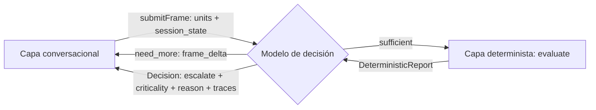

# Especificación Técnica — Capa Determinista
## Tech Sphere Challenge 2 · Modelado del módulo de evaluación estructural

**Versión:** 1.0 · **Fecha:** 6 de agosto de 2026 · **Autor:** Arcandan López Aburto (Medellín)

**Alcance:** el módulo que el modelo de decisión invoca **una vez declarada la suficiencia del contexto**. Cubre su objeto de evaluación, el contrato de invocación (`DeterministicPort`), el tratamiento de las unidades recibidas, la selección y adaptación de motores, y la forma de su reporte. Incluye ADR-006…ADR-010 y la separación explícita entre **forma** (cerrada aquí) y **contenido** (PENDIENTE-7AGO).

**Fuera de alcance:** la lógica clínica interna del modelo de decisión, la ponderación de la evidencia, el motor RAG, la extracción conversacional (`docs/Especificacion-Capa-Conversacional.md`) y la captura de voz (`docs/Especificacion-Interfaz-Voz.md`).

**Base conceptual:** `docs/Logica-General-Determinista-Convergencia-Derivacion-Colapso.md` (Motor A) y `docs/Guia-Motores-Deterministas-Criterio-Contextual.md` (selección y vocabulario). Este documento **instancia** esos motores; no los redefine.

---

## 1. Qué es este módulo

El modelo de decisión, tras cerrar el bucle de suficiencia con la capa conversacional, tiene un contexto clínico completo pero **probabilístico**: fue interpretado por un LLM y contrastado contra documentos por similitud semántica. Antes de emitir la decisión de alerta, necesita una segunda lectura del mismo contexto que sea **reproducible y auditable**.

Ese es el módulo determinista: recibe el contexto declarado suficiente, ejecuta sobre él una secuencia aritmética sin azar ni inferencia, y devuelve una lectura estructural del estado del paciente. Devuelve **evidencia**, no juicio. La ponderación de esa evidencia y la decisión de alertar son del modelo.

Su valor no es acertar más que el LLM. Es que, ante la pregunta *"¿por qué se alertó a este paciente?"*, exista una cadena de razones que no dependa de una inferencia irrepetible.

---

## 2. ADR-006 — El objeto de evaluación: funcionalidad, interacción e integridad

**Contexto.** La tentación natural al construir un módulo determinista sobre información clínica es clasificar hacia entidades diagnósticas: dado un cuadro, proponer la patología. Es la salida que parece más útil y es la que hay que rechazar.

**Decisión.** El módulo **no diagnostica**. Evalúa tres ejes, y solo tres:

| Eje | Pregunta que responde | Naturaleza |
|---|---|---|
| **Funcionalidad** | ¿Las funciones fisiológicas comprometidas operan dentro de lo esperado para este momento post-operatorio? | Estado de desempeño |
| **Interacción** | ¿Los hallazgos se relacionan entre sí, se refuerzan o configuran un patrón compartido? | Relación entre hallazgos |
| **Integridad sistémica** | ¿La organización estructural de los sistemas involucrados se mantiene, y qué parte no pudo evaluarse? | Estado estructural y cobertura |

**Por qué.** Cuatro razones convergen. *Competencia*: el equipo no es experto médico; construir un clasificador diagnóstico exigiría autoridad clínica que no se tiene, y el error sería invisible y grave. *Suficiencia*: la decisión terminal del sistema es binaria —alertar o no—, y para eso no hace falta un diagnóstico: basta detectar que algo no funciona, que varios hallazgos convergen, o que la integridad está comprometida. *Responsabilidad*: un módulo que no nombra enfermedades no puede ser leído como veredicto médico, lo que mantiene la autoridad donde corresponde. *Herencia*: es la postura del prototipo de origen —"mapa de verificación, no diagnóstico"— y conviene sostenerla, no abandonarla al escalar.

**Consecuencia.** El universo de clases del dominio (§7) se construye con vocabulario **funcional y estructural** —compromiso, alteración, pérdida de integridad, no evaluable— y nunca con nombres de enfermedades. Si una clase del catálogo puede leerse como diagnóstico, está mal formulada.

---

## 3. ADR-007 — El módulo no pondera: entrega evidencia ponderable

**Contexto.** `Arquitectura v0.3` §3.1 dice que la capa determinista "se referencia como **ponderación** en la decisión final". Esa formulación admite dos lecturas: que el módulo produzca un peso numérico, o que su salida sea lo que el decisor pondera.

**Decisión.** La segunda. El módulo **no emite score, ni recomendación, ni bandera de alerta**. Emite un reporte estructurado; el decisor lo pondera contra su propio criterio y su evidencia RAG.

**Por qué.** Para emitir un peso, el módulo tendría que conocer la escala de decisión del modelo obligatorio —que no se conoce hasta el 7 de agosto— y quedaría acoplado a él, rompiendo la tercera costura de aislamiento. Al no ponderar, el módulo es **completamente independiente del modelo de decisión**: se construye, se prueba y se versiona sin saber cuál será. Además evita el peor fallo posible de este componente: que un número producido por una tabla se lea como criterio clínico.

**Consecuencia.** El tipo `DeterministicReport` (§6.3) **no contiene** los campos `alert`, `score`, `risk`, `severity` ni `recommendation`. Su ausencia es normativa, no un olvido.

---

## 4. ADR-008 — Motor A en runtime; Motor B en calibración

**Decisión.** El camino evaluable ejecuta el **Motor A** (clasificatorio). El **Motor B** (relacional dinámico) se usa **fuera de runtime**, en la fase de construcción del dominio.

**Por qué.** El criterio decisivo es la trazabilidad. El Motor A permite reconstruir cada afirmación —clase ← elemento ← unidad ← ruta—; el Motor B produce equilibrios que no se descomponen por término. La rúbrica del reto evalúa explicabilidad, y la capa existe precisamente para aportar lo que el LLM no puede: una razón exacta. Un módulo determinista cuya salida no se puede explicar término a término no cumple su propia función.

**Dónde entra entonces el Motor B.** En la **calibración del dominio**: con el corpus documental (§8) se modela cómo se influyen entre sí los factores post-operatorios, se identifican los nodos de alta propagación y las combinaciones que llevan a colapso de umbral, y **ese hallazgo se codifica como reglas de composición del Motor A** (§7.4). El Motor B descubre; el Motor A ejecuta. Su producto es la taxonomía, no una salida de runtime.

**Extensión declarada (no adoptada).** Si más adelante se quisiera Motor B en runtime para el eje de interacción, debe declararse que ese eje pierde trazabilidad fina y compensarse reportando `desplazamiento` por nodo (Guía §4.7). No se adopta hoy.

---

## 5. ADR-009 — La no evaluabilidad es resultado, no vacío

**Contexto.** La capa conversacional puede cerrar unidades como `suspendida` con causa (`no_sabe`, `no_comprende`, `rehusa`, `sin_respuesta`, `interrumpido`). El módulo recibe, por tanto, un contexto que fue declarado suficiente **pero no necesariamente completo**.

**Decisión.** Las unidades no evaluables **no se omiten del reporte**: se declaran como cobertura ausente, con su causa y el eje que dejaron sin evaluar.

**Por qué.** Para el decisor hay una diferencia clínica enorme entre "se evaluó la función respiratoria y está bien" y "no se pudo evaluar la función respiratoria". Si el reporte solo enumera hallazgos positivos, ambas situaciones se ven idénticas: silencio. Un módulo que calla lo que no pudo mirar induce falsos negativos por omisión — el error más caro del sistema, porque la degradación segura (sesgo a alertar) no puede dispararse sobre información que nunca llegó.

**Consecuencia.** `DeterministicReport.coverage` (§6.3) es un campo obligatorio y debe enumerar tanto lo evaluado como lo no evaluado con su causa.

### 5.1 Hueco de dominio y error de cableado no son lo mismo — **añadido el 7-ago (hallazgo D5)**

El cierre total (§9) manda que **todo valor sin mapeo caiga a la clase de fallback**, nunca a excepción. Correcto — pero al construir el módulo apareció un caso que esa regla trataba mal:

> Si la capa conversacional emite `dolor` donde el dominio declara `dolor_intensidad`, la unidad **colapsa al fallback en silencio**. El reporte se produce, es válido, y está vacío de esa unidad sin que nada lo señale.

Son dos situaciones distintas y la regla las confundía:

| Situación | Qué significa | Cómo se trata |
|---|---|---|
| **Valor sin mapeo** en una unidad conocida | Hueco legítimo del dominio: el paciente dijo algo que la taxonomía no cubre | **Clase de fallback.** Eleva `fallback_rate`. Es información sobre la cobertura del dominio |
| **`unit_id` que el dominio no declara** | **Error de cableado** entre capas. Nadie dijo nada nuevo: alguien escribió mal un identificador | **`no_evaluada` con causa `unidad_desconocida`**, más entrada en `quality.warnings`. Nunca fallback |

**Por qué esta separación importa más de lo que parece.** El fallback es un dato sobre el *paciente y el dominio*; el `unit_id` desconocido es un dato sobre *nosotros*. Meterlos en el mismo cubo hace que un error de integración se lea como una limitación de la taxonomía — y esa es la clase de fallo que sobrevive intacta hasta la demostración, porque el sistema nunca deja de funcionar.

**No se resuelve rechazando.** Lanzar excepción violaría el cierre total. Se resuelve **declarándolo como resultado**, que es exactamente el principio de este ADR aplicado un nivel más arriba: la no evaluabilidad es resultado, y la razón de la no evaluabilidad también.

**Verificación.** Un `UnitResult` con `unit_id` inexistente en el dominio aparece en `coverage.no_evaluadas` con causa `unidad_desconocida`, **no** eleva `fallback_rate`, y deja `warnings` no vacío. El dominio declara sus identificadores canónicos en `unidades_canonicas` para que la comprobación sea trivial.

---

## 6. Contrato `DeterministicPort`

### 6.1 Punto de invocación



El módulo se invoca **una sola vez por sesión**, después de que el decisor resuelve `FrameVerdict.status = "sufficient"` y **antes** de construir la `Decision`. No participa del bucle de suficiencia, no se invoca en urgencia por `escalateNow` (en urgencia no hay bucle ni tiempo de análisis estructural), y no se invoca sobre marcos parciales.

**Anclaje con el contrato ya cerrado.** La `Decision` de la capa conversacional (§15.1 de su spec) declara `traces: { doc_ids, rules_fired }`, con `rules_fired` marcado PENDIENTE-7AGO. **Este módulo es el productor de `rules_fired`**: los identificadores de reglas de su reporte se transfieren allí. El hueco ya estaba previsto; esta especificación lo llena.

### 6.2 Interfaz

Transporte-agnóstico, igual que `DecisionPort`: llamada de función en proceso, HTTP con el mismo esquema si se separa.

```ts
interface DeterministicPort {
  /** Evaluación estructural. Función PURA y SÍNCRONA: sin red, sin reloj, sin estado. */
  evaluate(req: DeterministicRequest): DeterministicReport;

  /** Introspección del dominio cargado. Para auditoría y para el README de métricas. */
  describeDomain(): DomainManifest;
}

interface DeterministicRequest {
  session_id: string;
  frame_id: string;
  /** Las MISMAS unidades que el decisor recibió en submitFrame. Sin re-tipar. */
  units: UnitResult[];
  /** Modificadores transversales del caso (Motor A §2.1). El temporal lo trae el dataset: `dia_postop`. */
  modifiers: Record<string, string | number | boolean | null>;
  /** Versión de taxonomía exigida; si no coincide con la cargada, error explícito. */
  domain_version: string;
}
```

`UnitResult` es el tipo ya definido en la spec conversacional §15.1. **No se introduce un segundo esquema**: el módulo consume exactamente lo que el decisor ya tiene en la mano, por la misma razón que `frame_delta` reutiliza `ContextFrame` — dos esquemas para el mismo objeto se desincronizan.

### 6.3 El reporte

```ts
interface DeterministicReport {
  domain_version: string;
  frame_id: string;

  funcionalidad: {
    clases: ClassHit[];          // clases de compromiso funcional presentes
    cardinalidad: number;        // |clases| — 1 = patrón puro, >1 = coexistencia
    lectura: "patron_unico" | "coexistencia" | "sin_hallazgo";
  };

  interaccion: {
    convergentes: ClassHit[];    // clases presentes en >1 unidad (Motor A §5.2)
    composiciones: CompositionHit[];  // combinaciones declaradas que se activaron
    lectura: "patron_compartido" | "hallazgos_independientes" | "sin_hallazgo";
  };

  integridad: {
    comprometidas: StructureHit[];    // estructuras con compromiso declarado
    lectura: "integra" | "comprometida" | "no_determinable";
  };

  /** ADR-009 — obligatorio. Qué se pudo mirar y qué no. */
  coverage: {
    evaluadas: string[];                       // unit ids que entraron al cálculo
    no_evaluadas: Array<{
      unit_id: string;
      causa: string;                           // heredada de UnitResult.cause
      eje_afectado: Array<"funcionalidad" | "interaccion" | "integridad">;
    }>;
    ratio: number;                             // evaluadas / total
  };

  /** Trazabilidad completa: toda afirmación reconstruible hasta la entrada. */
  trace: Array<{
    rule_id: string;                 // identificador estable -> Decision.traces.rules_fired
    clase: string;
    origen_unit_ids: string[];
    origen_valores: Array<string | number | boolean>;   // normalized que dispararon
  }>;

  /** Salud del propio módulo, no del paciente. */
  quality: {
    fallback_rate: number;           // proporción de valores caídos a clase de fallback
    unidades_condicionadas: string[];// cubierta_condicionada con dependencias abiertas
    warnings: string[];
  };
}
```

**Campos deliberadamente ausentes:** `alert`, `score`, `risk`, `severity`, `recommendation`, `diagnosis`. Su ausencia implementa ADR-006 y ADR-007. Cualquier propuesta futura de añadirlos debe pasar por un ADR que revierta estas decisiones explícitamente.

`lectura` en cada eje es una etiqueta enumerada, no prosa: el módulo no redacta. La verbalización clínica es del decisor (`reason`) y la verbalización al paciente es de la conversacional (`say_to_patient`).

### 6.4 Los tipos de hallazgo — **añadido el 7-ago**

*El reporte usaba `ClassHit`, `CompositionHit`, `StructureHit` y `DomainManifest` sin declararlos, y WO-31 los daba por definidos "exactamente como la spec". Se declaran aquí.*

**No son cuatro tipos arbitrarios: los tres primeros son los tres ejes de ADR-006.** `ClassHit` es **funcionalidad** —lo que ocurre dentro de una unidad—; `CompositionHit` es **interacción** —lo que solo existe entre unidades—; `StructureHit` es **integridad sistémica** —lo que se afirma del caso completo—. Esa correspondencia es la que fija sus formas y evita inventarlas.

```ts
/** Eje FUNCIONALIDAD — una clase presente, con las unidades que la produjeron. */
interface ClassHit {
  rule_id: string;                     // estable -> Decision.traces.rules_fired
  clase: string;                       // identificador de clase del dominio cargado
  origen_unit_ids: string[];           // qué unidades colapsaron a esta clase
  origen_valores: Array<string | number | boolean>;   // los `normalized` que mapearon
  fallback: boolean;                   // true si llegó por la clase de fallback
}

/** Eje INTERACCIÓN — una composición declarada que se activó. */
interface CompositionHit {
  rule_id: string;
  clases_requeridas: string[];         // lo que la regla exigía
  clase_producida: string;             // lo que la regla emite
  origen_unit_ids: string[];           // de dónde salieron las clases requeridas
}

/** Eje INTEGRIDAD — una estructura del dominio con compromiso declarado. */
interface StructureHit {
  rule_id: string;
  estructura: string;                  // nodo del árbol taxonómico del dominio
  clases_contribuyentes: string[];     // qué clases sostienen la afirmación
  origen_unit_ids: string[];
}

/** Introspección del dominio cargado — para auditoría y para el README de métricas. */
interface DomainManifest {
  domain_version: string;
  domain_name: string;
  checksum: string;                    // hash del archivo de dominio: detecta edición silenciosa
  clases: number;
  composiciones: number;
  modificadores: string[];
  /** ADR-010 — obligatorio y legible fuera de contexto. */
  validez_clinica: "sin_validez_clinica_dominio_sintetico" | "validado_por_experto";
}
```

**Tres invariantes que estas formas imponen y que WO-31 debe probar:**

1. **`rule_id` es obligatorio en los tres.** Son la fuente única de `Decision.traces.rules_fired`: un hallazgo sin `rule_id` es un hallazgo no reconstruible, y la trazabilidad es criterio de rúbrica, no adorno.
2. **Ninguno lleva peso, score ni orden de gravedad.** La prueba negativa de campos prohibidos (WO-25 paso 5) se extiende a estos cuatro tipos. Un `ClassHit` con un campo `severity` reintroduciría por la puerta de atrás justo lo que ADR-007 prohíbe.
3. **Todos llevan `origen_unit_ids`, con ese nombre exacto en los tres.** Toda afirmación del reporte tiene que poder recorrerse hacia atrás hasta las unidades y sus valores normalizados. Es lo que permite que el decisor cite regla y evidencia en la misma frase.

   *`origen_unit_ids` es **procedencia de la evidencia**, no pertenencia al eje (añadido 7-ago, hallazgo D10).* En un `StructureHit`, las unidades que lo acompañan son **de dónde viene la afirmación**, no qué unidades pertenecen a ese eje del dominio. Una clase compuesta aporta las unidades de **sus partes**, que pueden ser de otro eje: `convergencia_sistemica` declara `eje: interaccion` —donde el dominio pone una sola unidad, `fiebre`— y sin embargo su `ST-interaccion` llega con `["apetito", "fiebre", "sueno"]`, porque esa clase solo existe por la coincidencia de las tres. Se conserva la unión y no el recorte porque la invariante 3 lo exige: recortar a `fiebre` dejaría la afirmación citando una evidencia que **no basta para producirla**, y el decisor no podría reconstruir por qué ese eje está comprometido. **Para las clases simples procedencia y pertenencia coinciden y la distinción no se nota; para las compuestas se separan.** Quien consuma `integridad.comprometidas` no debe leer `origen_unit_ids` como pertenencia: decir que el apetito compromete el eje de interacción es una afirmación que el dominio no hace. La pertenencia declarada vive en `dominio.ejes`.

   *Nota de nomenclatura (corrección X-6, 7-ago).* Una versión anterior llamaba `unit_ids` al campo en `ClassHit` y `origen_unit_ids` en los otros dos, apoyándose en que en `ClassHit` las unidades son constituyentes directos y en los demás son origen transitivo. **Se unifica.** Esa distinción ya la carga el tipo —un `ClassHit` es por unidad por definición, un `CompositionHit` es entre unidades por definición— y codificarla otra vez en el nombre del campo no aporta y sí cuesta: con un nombre único, esta invariante se prueba con **un test que recorre los tres tipos**; con dos nombres hace falta un mapa, y el próximo tipo de hallazgo invitaría a un tercer nombre.

`checksum` en el manifiesto no es ceremonia: el dominio es dato cargado de archivo, y sin huella el módulo no puede distinguir dos ejecuciones con la misma `domain_version` y contenido distinto — que es exactamente el modo de fallo que rompería el determinismo que este módulo promete.

---

## 7. Tratamiento de la entrada

### 7.1 Elegibilidad por estado de extracción

No toda unidad entra al cálculo. La regla es determinista y se aplica antes de cualquier motor:

| `extraction` | ¿Entra al colapso? | Tratamiento |
|---|---|---|
| `cubierta` | Sí | Caso normal: su `normalized` se mapea a clase |
| `cubierta_condicionada` | Sí, marcada | Entra; su id se lista en `quality.unidades_condicionadas` con las dependencias abiertas |
| `hidratada_sin_normalizar` | No | Hay evidencia pero no valor mapeable → `coverage.no_evaluadas` con causa `sin_normalizar` |
| `suspendida` | No | → `coverage.no_evaluadas` con la causa original (ADR-009) |

**Se consume `normalized`, nunca `raw`.** El literal del paciente (ADR-004 de la conversacional) viaja para la traza y para el decisor, pero un motor determinista no interpreta lenguaje natural — es un límite declarado de la capa en `Arquitectura v0.3` §3.

**`state` y `confidence` no filtran.** Una unidad extraída con dificultad (`state` bajo) o con mapeo dudoso (`confidence` baja) **entra igual** al cálculo; su calidad se reporta pero no se descarta. Descartar por baja calidad sería una decisión clínica, y esa autoridad no es del módulo. El decisor ya tiene ambos valores y decide cuánto pesarlos.

### 7.2 Aplicación de los motores

El módulo ejecuta, en secuencia fija y sin ramificaciones:

1. **Filtro de elegibilidad** (§7.1) → conjunto de unidades computables y registro de cobertura.
2. **Colapso clasificatorio** (Motor A §4) sobre los valores normalizados → clases por unidad, con clase de fallback para lo no mapeado.
3. **Cardinalidad** por eje → lectura de patrón puro vs. coexistencia.
4. **Convergencia de clase** (Motor A §5) → matriz unidades × clases, columnas sobre umbral.
5. **Evaluación de composiciones** (§7.4) → combinaciones declaradas que se activaron.
6. **Ensamblado del reporte** con trazas y cobertura.

Los pasos 1–6 son aritmética pura: mismo input, mismo output, sin excepción. **Los motores solo ejecutan la secuencia y entregan resultado** — no evalúan, no priorizan, no deciden.

### 7.3 Modificadores transversales

Los modificadores (`DeterministicRequest.modifiers`) condicionan qué reglas aplican y cómo se enuncia la lectura, **sin alterar el colapso** (Motor A §2.1). Candidatos naturales del dominio: tipo de procedimiento, tiempo transcurrido desde la cirugía, y las variables que el marco contextual defina. Su catálogo concreto es **PENDIENTE-7AGO**; el mecanismo está fijado hoy.

El tiempo post-operatorio merece nota: un mismo hallazgo tiene lectura distinta a las 6 horas que a los 7 días. Es el modificador de mayor impacto esperado y el primero a instanciar cuando llegue el marco.

### 7.4 Composiciones

Una **composición** es una combinación declarada de clases cuya presencia conjunta porta significado que ninguna parte tiene por separado (Motor A §8). Es el mecanismo por el que el eje de interacción produce lectura sin necesidad del Motor B en runtime.

Cada composición declara: identificador estable, conjunto de clases requeridas, unidades de origen admisibles y la clase compuesta que produce. Su activación es determinista —presencia del conjunto completo— y queda registrada en `trace` como cualquier otra regla.

El **catálogo** de composiciones es el producto directo de la calibración con Motor B (ADR-008) sobre el corpus documental. Contenido: **PENDIENTE-7AGO**.

---

## 8. ADR-010 — Fuente de conocimiento: destilación, no recuperación

**Contexto.** El corpus clínico esperado —dataset del reto, más literatura de procedimientos y patología— alimenta dos consumidores distintos: el RAG del modelo de decisión y la taxonomía de este módulo.

**Decisión.** El mismo corpus se procesa de dos maneras y por dos caminos separados. El **RAG** lo indexa como texto y lo recupera por similitud en runtime. El **módulo determinista** lo **destila previamente** a estructura cerrada —taxonomía, clases, función de clase, composiciones— y en runtime **no consulta ningún documento**.

**Por qué.** Un motor determinista que consultara documentos en tiempo de ejecución dejaría de ser puro: su salida dependería del estado del índice, y perdería reproducibilidad — exactamente la propiedad por la que existe. La destilación previa mantiene la pureza y, además, hace que actualizar el conocimiento del módulo sea un cambio **versionado y auditable** (`domain_version`), no un efecto lateral de subir un PDF.

**Consecuencia operativa.** El "conocimiento vivo" del reto (subir documento = aprender) afecta al RAG de forma inmediata; afecta al módulo determinista solo mediante una nueva versión de taxonomía. Esa asimetría debe declararse en el informe, no disimularse: son dos mecanismos con garantías distintas, y confundirlos sería prometer una actualización en caliente que el módulo no puede ofrecer sin dejar de ser determinista.

---

## 9. Guardarraíles

**Pureza verificable.** Sin red, sin reloj, sin aleatoriedad, sin estado entre invocaciones. Prueba de aceptación: la misma `DeterministicRequest` con la misma `domain_version` produce reportes **idénticos byte a byte** en ejecuciones separadas.

**Versión obligatoria.** Si `request.domain_version` no coincide con la taxonomía cargada, el módulo **falla de forma explícita** en vez de calcular con la versión disponible. Un reporte producido con una taxonomía distinta a la esperada es peor que ningún reporte.

**Cierre total.** Ningún valor normalizado provoca excepción: lo no mapeado cae a la clase de fallback (Motor A §4.3) y eleva `quality.fallback_rate`. Un `fallback_rate` alto en uso real es señal de taxonomía incompleta, y es la métrica de mantenimiento del módulo.

**Enunciación de la ausencia.** "Ningún hallazgo funcional", "hallazgos independientes sin patrón compartido" e "integridad no determinable" son lecturas afirmativas con etiqueta propia. Nunca se representan por lista vacía sin etiqueta.

**Sin degradación propia.** La degradación segura —sesgo a alertar con contexto incompleto— **se aplica en el decisor**, como ya establece la spec conversacional §16. El módulo solo garantiza que la información para aplicarla (`coverage`, `quality`) llegue completa.

---

## 10. Forma cerrada hoy · contenido pendiente

La lección de la capa conversacional se aplica aquí: **se instancia la forma sin esperar el contenido**.

| Elemento | Estado |
|---|---|
| Objeto de evaluación (3 ejes) | ✅ Cerrado — ADR-006 |
| Rol frente al decisor (no pondera) | ✅ Cerrado — ADR-007 |
| Selección de motor | ✅ Cerrado — ADR-008 |
| Contrato `DeterministicPort` y `DeterministicReport` | ✅ Cerrado — §6 |
| Punto de invocación y anclaje con `rules_fired` | ✅ Cerrado — §6.1 |
| Elegibilidad por estado de extracción | ✅ Cerrado — §7.1 |
| Secuencia de ejecución | ✅ Cerrado — §7.2 |
| Mecanismo de modificadores y composiciones | ✅ Cerrado — §7.3, §7.4 |
| Guardarraíles y criterios de aceptación | ✅ Cerrado — §9, §11 |
| Tipos de hallazgo (`ClassHit`, `CompositionHit`, `StructureHit`, `DomainManifest`) | ✅ Cerrado — §6.4 |
| **Catálogo de modificadores** | ✅ Cerrado — `dia_postop` ∈ {1,3,7,14}, lo trae el dataset |
| **Taxonomía derivativa clínica** | 🔲 Abierto — versión mínima C1: 3 clases |
| **Universo de clases funcionales/estructurales** | 🔲 Abierto — C1 |
| **Función de clase** (valor normalizado → clase) | 🔲 Abierto — reducido a decidir cortes sobre magnitudes numéricas |
| **Catálogo de composiciones** | 🔲 Abierto — C1: 2 reglas |
| **Umbral de convergencia** | 🔲 Abierto — C1 |

**Construcción contra taxonomía semilla.** Igual que la interfaz se construyó contra un backend simulado y la conversacional contra un decisor simulado, el módulo se construye contra una **taxonomía semilla** deliberadamente mínima —dos o tres unidades, cuatro o cinco clases, una composición— cuyo único fin es ejercitar el motor y las pruebas. La semilla es desechable y **no pretende validez clínica**; debe declararlo en su propio encabezado para que nadie la confunda con dominio real.

Con eso, el módulo es **construible y testeable hoy**, y el 7 de agosto solo se sustituye el archivo de dominio.

### 10.1 Estado tras el volcado del 7 de agosto

*Ver `docs/Acta-7AGO.md` §2.3. Tres precisiones que cambian el trabajo de esta capa:*

**La semilla deja de ser desechable y pasa a ser el plan.** La línea de corte C1 se activa **de entrada**, no condicionada a un hito: taxonomía a 3 clases y tabla de lectura a 2 reglas. Razón de asignación de horas, no de diseño — esta capa no es compuerta y no corresponde a ningún criterio identificable de la rúbrica publicada, mientras que el RAG paga 20 puntos y la lógica de decisión otros 20. Lo que se defiende en el video y ante el panel es la **arquitectura de dos votos**, y para eso la semilla basta.

**Las magnitudes de entrada resultaron numéricas, que es el mejor caso posible para esta capa.** `trayectorias_postop_silver.xlsx` entrega `dolor_nrs` (escala 0–10), `fiebre_c` (grados) y cuatro ordinales de estado —movilidad, herida, apetito, sueño—. La función de clase (T-3), que era "la pieza más costosa" del inventario, opera sobre valores comparables sin necesidad de criterio clínico externo para normalizar: solo hay que decidir los cortes.

**El modificador temporal viene dado.** `dia_postop` ∈ {1, 3, 7, 14} es exactamente el catálogo de modificadores por tiempo transcurrido que T-4 anticipaba. Un mismo valor de dolor significa cosas distintas al día 1 y al día 14, y el dataset lo trae estructurado.

**Consecuencia sobre el reporte:** la función de lectura VD que consume este reporte pasa a emitir tres niveles por **ADR-018** (criticidad ternaria). El `DeterministicReport` no cambia —sigue entregando evidencia por eje, no votos—; cambia solo su lectura, que vive en la capa de decisión y por tanto deja ADR-007 intacto.

---

## 11. Criterios de aceptación

1. `evaluate` es pura: misma entrada y versión → reporte idéntico, verificado por comparación directa en dos ejecuciones.
2. Ninguna unidad `suspendida` o `hidratada_sin_normalizar` desaparece del reporte: todas aparecen en `coverage.no_evaluadas` con causa y eje afectado.
3. Un valor normalizado fuera de la función de clase cae al fallback sin excepción y eleva `fallback_rate`.
4. Toda entrada de `trace` reconstruye la cadena clase ← unidad ← valor, y sus `rule_id` son estables entre versiones cuando la regla no cambió.
5. `domain_version` discordante produce error explícito, nunca cálculo silencioso.
6. El reporte no contiene ningún campo de decisión, score o diagnóstico (verificable por esquema).
7. Cada eje devuelve una etiqueta de `lectura` incluso sin hallazgos.
8. El módulo se ejecuta sin red y sin acceso a disco tras la carga de la taxonomía.
9. Con taxonomía semilla, la batería de pruebas del Motor A (Guía §7) pasa completa.

---

## 12. Límites del módulo

No diagnostica. No decide si se alerta. No pondera su propia salida. No consulta documentos en runtime. No interpreta lenguaje natural. No filtra unidades por calidad de extracción. No redacta prosa clínica ni mensajes al paciente. No conoce al modelo de decisión, ni a la capa conversacional, ni a la interfaz de voz. No expande su vocabulario en ejecución. No aplica la degradación segura. Y no omite nunca lo que no pudo evaluar.

---

*Documento 1.0 — especificación de la capa determinista. Instancia los motores de `Logica-General-Determinista-Convergencia-Derivacion-Colapso.md` bajo los criterios de `Guia-Motores-Deterministas-Criterio-Contextual.md`. Cierra la tercera costura de aislamiento de `Arquitectura v0.3` §5 y el productor de `Decision.traces.rules_fired`. Sus paquetes de trabajo (WO-25…) se documentan aparte.*
